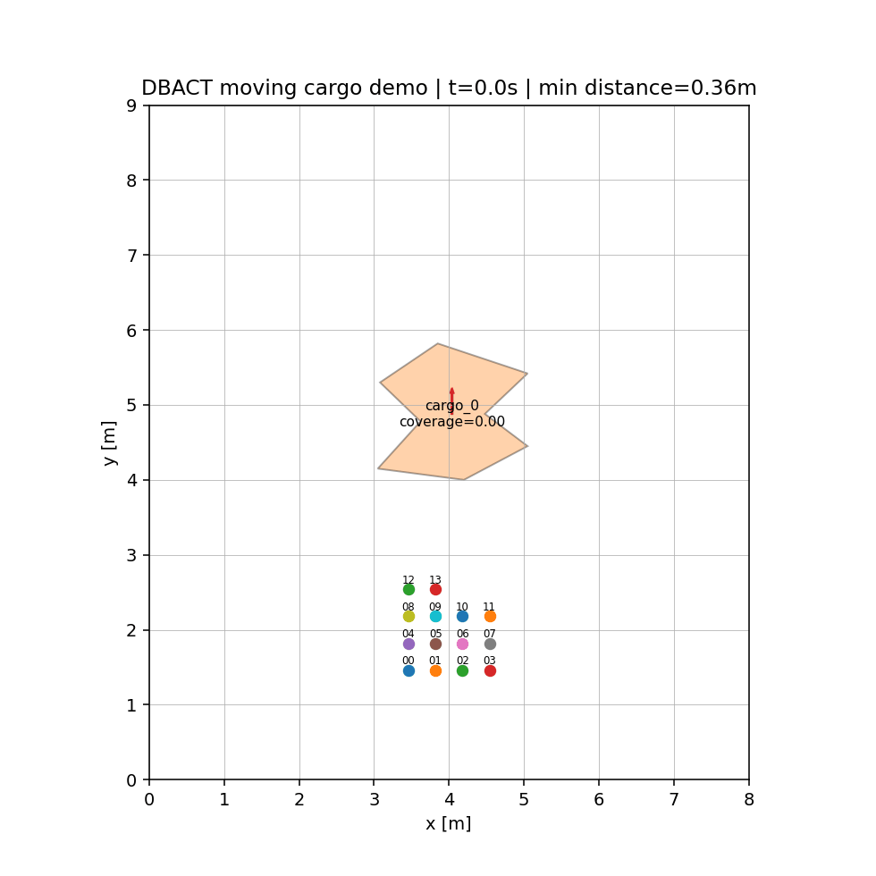
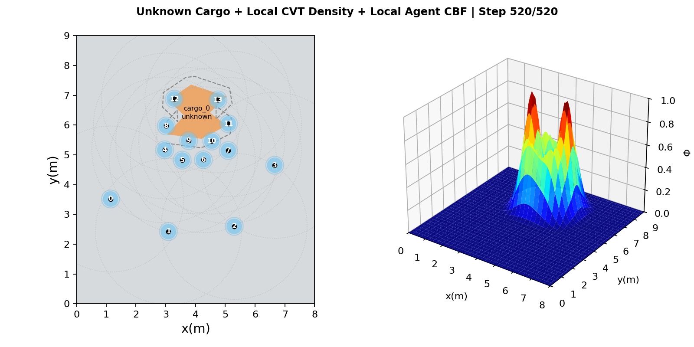
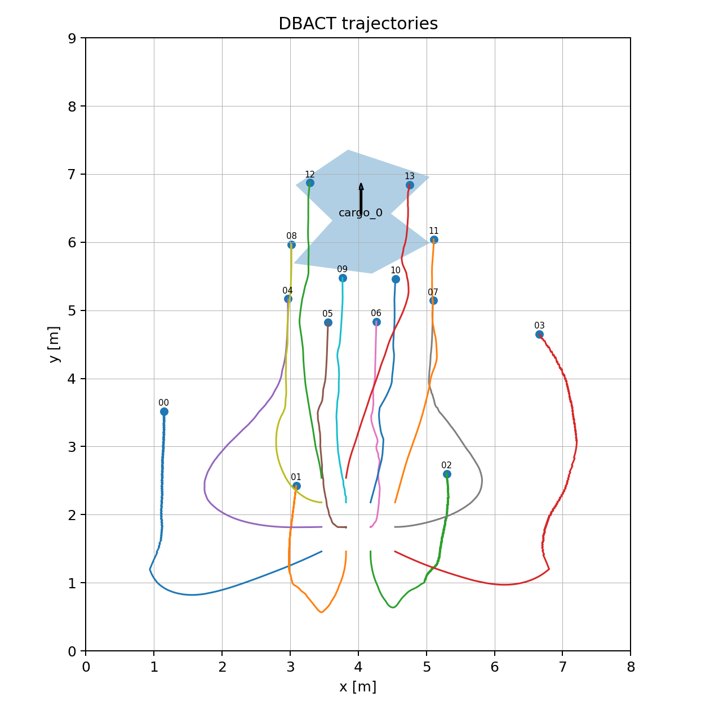
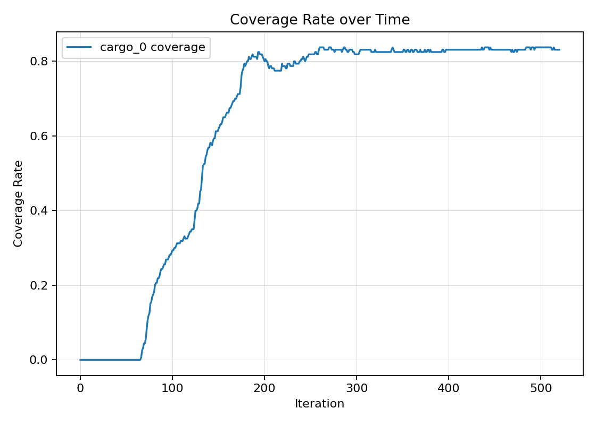
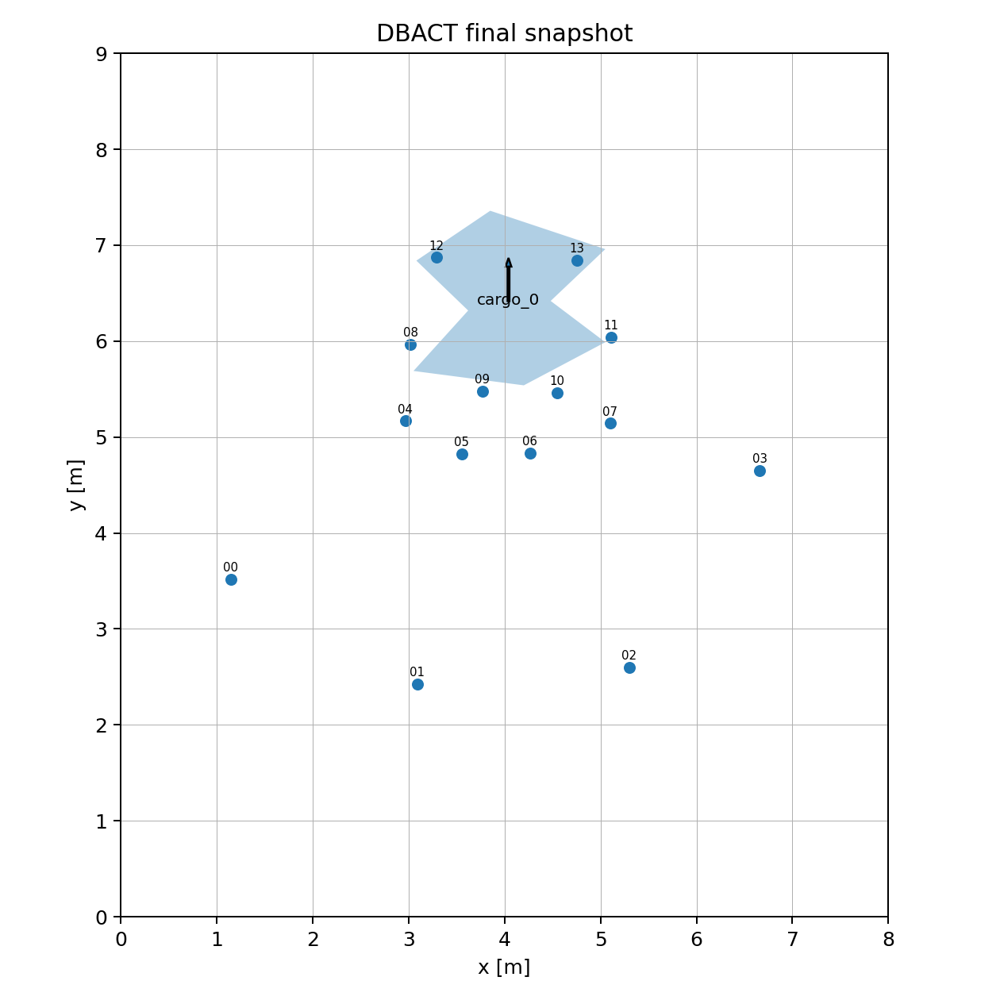

<div align="center">

# DBACT: Boundary-Aware Cooperative Transport

**Decentralized boundary-aware caging and transport for unknown-shaped objects with multiple mobile robots.**

<p>
  
  = 3.9">
  
  
</p>

[English](README.en.md) | [繁體中文](README.zh-TW.md) | [日本語](README.ja.md)

</div>

---

## Overview

DBACT is a research software stack for decentralized cooperative transport with multiple mobile robots. It targets a hard practical setting: robots do not assume the complete object geometry, object center, object radius, or a pre-defined team assignment.

Instead, robots use local boundary observations, neighbor communication, boundary-aware density, local CVT target allocation, and safety filtering to form a caging structure around unknown cargo. The repository also includes simulation tooling, MAS-compatible controller adapters, OptiTrack read-only tooling, and RoboMaster S1 command smoke paths.

**Core stack**: Python 3.9+, NumPy, Matplotlib, PyYAML, pytest, local CVT, CBF-style safety filtering, MAS adapter, OptiTrack read-only bridge, RoboMaster S1 smoke tests.

---

## Visual Showcase



<p align="center">
  <sub>Moving irregular cargo scenario: robots form a boundary-aware caging structure and move the object through local sensing and local coordination.</sub>
</p>

| Density and Local CVT | Trajectory |
| --- | --- |
|  |  |

| Coverage Curve | Final Snapshot |
| --- | --- |
|  |  |

---

## Features

- **Unknown-object friendly**: the controller does not directly consume cargo center, radius, vertices, or closest-boundary queries.
- **Rich simulation outputs**: runs produce trajectories, coverage curves, final snapshots, paper-style frames, CSV logs, and optional GIF animations.
- **Boundary-aware coordination**: local observations are converted into cage targets and density fields that attract robots to useful boundary locations.
- **Local CVT allocation**: each robot computes targets from itself and nearby neighbors rather than relying on a global assignment.
- **Hardware-oriented path**: MAS adapter, OptiTrack read-only logging, and RoboMaster S1 smoke tests are included for staged validation.

---

## Results And Visualizations

### Stage 1: Unknown Polygon Caging

Stage 1 validates that caging can be formed around arbitrary polygonal cargo without direct use of the complete cargo geometry inside the controller.

| Scenario | Cargo Type | Agents | Steps | Final Coverage | Recruited Agents | Min Inter-Agent Distance |
| --- | --- | ---: | ---: | ---: | ---: | ---: |
| `baseline_unknown_polygon_caging` | arbitrary polygon | 12 | 900 | 0.7625 | 6 / 12 | 0.3446 m |
| `one_rectangle_polygon_caging` | rectangle polygon | 12 | 900 | 0.7000 | 6 / 12 | 0.3446 m |
| `one_nonconvex_polygon_caging` | nonconvex polygon | 14 | 1000 | 0.90625 | 9 / 14 | 0.3393 m |

### Tight Baseline

| Scenario | Cargo Type | Agents | Steps | Final Coverage | Recruited Agents | Min Inter-Agent Distance |
| --- | --- | ---: | ---: | ---: | ---: | ---: |
| `baseline_unknown_polygon_caging_tight` | arbitrary polygon | 12 | 900 | 0.95625 | 11 / 12 | 0.3450 m |
| `one_rectangle_polygon_caging_tight` | rectangle polygon | 12 | 900 | 0.99375 | 9 / 12 | 0.3450 m |
| `one_nonconvex_polygon_caging_tight` | nonconvex polygon | 14 | 1000 | 0.9750 | 13 / 14 | 0.3370 m |

### Moving Irregular Cargo Demo

| Metric | Value |
| --- | ---: |
| Final time | 25.95 s |
| Final coverage | 0.83125 |
| Cargo displacement | 1.539 m |
| Recruited agents | 6 |
| Minimum inter-agent distance | 0.3571 m |
| Mean path length | 4.6999 m |

**Conclusion**: the tight caging settings improve boundary coverage while maintaining a minimum inter-agent distance above 0.33 m in the reported Stage 1 benchmarks.

---

## Quick Start

### 1. Clone

```bash
git clone https://github.com/Wu-kaixin/boundary-aware-cooperative-transport.git
cd boundary-aware-cooperative-transport
```

### 2. Create Environment

```bash
conda create -n dbact python=3.10
conda activate dbact
python -m pip install --upgrade pip
```

Alternative virtual environment:

```bash
python -m venv .venv
source .venv/bin/activate
python -m pip install --upgrade pip
```

Windows PowerShell:

```powershell
.\.venv\Scripts\Activate
```

### 3. Install

```bash
pip install -r requirements.txt
pip install -e .[dev]
```

### 4. Run One Demo

```bash
python -m dbact_sim.run_sim --config configs/sim/paper_like_irregular_moving_cargo.yaml --steps 520 --output runs/paper_like_irregular_moving_cargo --animate
```

Expected outputs:

```text
runs/paper_like_irregular_moving_cargo/
|-- animation.gif
|-- final_snapshot.png
|-- trajectory.png
|-- coverage_rate_curve.png
|-- trajectories.csv
|-- coverage_rates.csv
`-- figures/
    |-- FIG_0.png
    |-- FIG_130.png
    |-- FIG_260.png
    |-- FIG_390.png
    `-- FIG_520.png
```

### 5. Run Standard Scenarios

```bash
python scripts/run_all_scenarios.py --steps 400 --animate
```

### 6. Verify

```bash
python -m pytest -q tests
python -m compileall -q src tests scripts platforms/mas_public/src platforms/mas_public/apps
```

MAS platform tests:

```bash
python -m pytest -q --rootdir platforms/mas_public platforms/mas_public/apps/pytest_tests
```

---

## Repository Structure

```text
boundary-aware-cooperative-transport/
|-- README.md                         # Language selector and visual preview
|-- README.en.md                      # English README
|-- README.zh-TW.md                   # Traditional Chinese README
|-- README.ja.md                      # Japanese README
|-- configs/
|   |-- sim/                          # Simulation scenarios
|   `-- mas/                          # MAS controller configs
|-- docs/
|   |-- assets/                       # Git-tracked README images and GIFs
|   |-- ARCHITECTURE.md               # Architecture notes
|   |-- ALGORITHM.md                  # Algorithm notes
|   `-- stage1_results.md             # Stage 1 benchmark results
|-- src/
|   |-- dbact/                        # Core algorithm modules
|   |-- dbact_sim/                    # Simulation environment and visualization
|   `-- mas_adapter/                  # MAS-compatible adapter
|-- scripts/                          # Batch runs, MAS mock pipeline, S1 smoke tests
|-- tests/                            # Unit and smoke tests
|-- runs/                             # Local generated outputs, ignored by Git
`-- platforms/mas_public/             # Vendored MAS platform code
```

---

## How It Works

1. **Load a scenario**: `dbact_sim.run_sim` reads a YAML file and initializes the world, robots, cargo, controller parameters, and output directory.
2. **Observe local boundaries**: each robot receives only local boundary observations within its sensing range.
3. **Generate cage targets**: every boundary point is shifted outward by the desired cage offset.

```text
q_target = b + d_cage * n_out
```

4. **Build boundary-aware density**: cage targets become Gaussian density peaks used by local CVT.
5. **Allocate local CVT targets**: each robot uses only itself and neighbors within communication range.
6. **Apply safety filtering**: the CBF-style filter keeps inter-agent distances above the configured minimum.

```text
h_ij = ||p_i - p_j||^2 - d_min^2 >= 0
```

7. **Export data and figures**: simulations save CSV logs, snapshots, trajectories, coverage curves, paper-style figures, and optional GIFs.
8. **Move toward hardware**: the MAS adapter wraps DBACT as a `WorldState -> ControlCommand` controller for staged validation.

---

## MAS And Hardware Validation

Mock MAS pipeline:

```bash
python scripts/run_mock_mas_pipeline.py --steps 80 --dt 0.05 --print-every 20 --output runs/mock_mas_pipeline
```

MAS dry-run:

```bash
cd platforms/mas_public
python apps/dbact/run_dtransport_dry_run.py --steps 80 --dt 0.05 --print-every 20 --output data/dry_runs/dtransport_auto_init --clamp-to-world-bounds
```

OptiTrack read-only check:

```bash
cd platforms/mas_public
python apps/dbact/log_optitrack_world_state.py --mock --frames 50 --hz 100 --print-every 10 --output data/optitrack_readonly/mock_world_states.csv
```

Safety guidance:

- Run read-only OptiTrack logging before publishing control commands.
- Verify robot ID to rigid-body mapping one robot at a time.
- Use very low speed limits for the first physical run.
- Keep a physical emergency stop available during hardware tests.
- Inspect command and state logs after each run.

---

## Documentation

| File | Content |
| --- | --- |
| `docs/ARCHITECTURE.md` | Package layout and data flow. |
| `docs/ALGORITHM.md` | Boundary targets, local CVT, safety filter, and transport model. |
| `docs/MAS_INTEGRATION.md` | MAS integration guide. |
| `docs/ROADMAP.md` | Development roadmap. |
| `docs/stage1_results.md` | Stage 1 caging results. |
| `docs/assets/README.md` | README asset inventory and source mapping. |

---

## Contributing

Issues, reproduction reports, scenario configs, visualizations, documentation updates, and platform integration improvements are welcome.

Before opening a pull request, run:

```bash
python -m pytest -q tests
python -m compileall -q src tests scripts platforms/mas_public/src platforms/mas_public/apps
```

---

## License

This project is released under the MIT License. See [LICENSE](LICENSE) for details.
