<div align="center">

# DBACT

### Decentralized Boundary-Aware Cooperative Transport

Closed-loop discovery, mapping, operational enclosure, contact-only transport,
braking, and hold for initially unknown simple shapes.

[English](README.md) · [繁體中文](README.zh-TW.md) · [日本語](README.ja.md)


</div>

DBACT is a research system for decentralized multi-robot transport of an object
whose full boundary, pose, centre, radius, and required team size are not given
to the controller. Robots build local boundary maps, form an operational
enclosure, establish physical contact, regulate task progress and wrench, brake,
and hold. Cargo motion is produced only by the simulated contact engine; the
controller never writes cargo position or velocity.

This branch removes the old 500-frame success premise. Every episode runs until
`HOLD`, an explicit classified failure, or a configured safety timeout. The
research target is **theory-consistent high-confidence simulation**, not a
selected-case demo or a physical-robot claim.

> [!IMPORTANT]
> The current result is a **full-workspace discovery guarantee plus a
> conditional guarantee for encircle-able and transportable simple shapes**.
> It is not unconditional convergence for every planar shape, and operational
> boundary enclosure is not formal configuration-space caging.

[Quick start](#quick-start) · [System](#closed-loop-system) ·
[Audited run](#audited-closed-loop-witness) ·
[Statistical evidence](#unscreened-arbitrary-shape-validation) ·
[Claims](#claim-ledger) · [Reproduction](#reproduction) ·
[Full report](docs/FINAL_RESEARCH_REPORT_CODEX_V1.md)

---

## Current evidence at a glance

| Question | Current answer | Evidence class |
|---|---|---|
| Can the team discover an admissible object anywhere in the rectangular workspace? | Yes, under the finite-ray, contained-feature, lane-spacing, speed, and bounded-workspace premises. | Mathematically proved |
| Does a complete contact-only closed loop exist? | Yes. The retained truth-audited witness reaches `HOLD` at frame 327. | Empirically validated |
| Does the representative run maintain the full safety margin? | Yes: 5,886 QP solves, zero fallback, zero infeasibility, zero rho relaxation. | Empirically validated |
| Does the method work for every simple shape without conditions? | Not established. The executable theorem domain rejects 53 of 60 sampled episodes. | Unsupported as a universal claim |
| Is enclosure formal caging? | No. It is an operational boundary-enclosure certificate. | Explicit non-claim |
| Is there a finite-time bound? | The conditional formula is proved, but current domain-wide positive rate constants are not. Eligible failures also prevent an empirical upper bound. | Formula proved; numerical bound unavailable |
| Are physical robots validated? | No. This branch deliberately contains no physical-robot experiment. | Out of scope |

## Closed-loop showcase

<p align="center">
  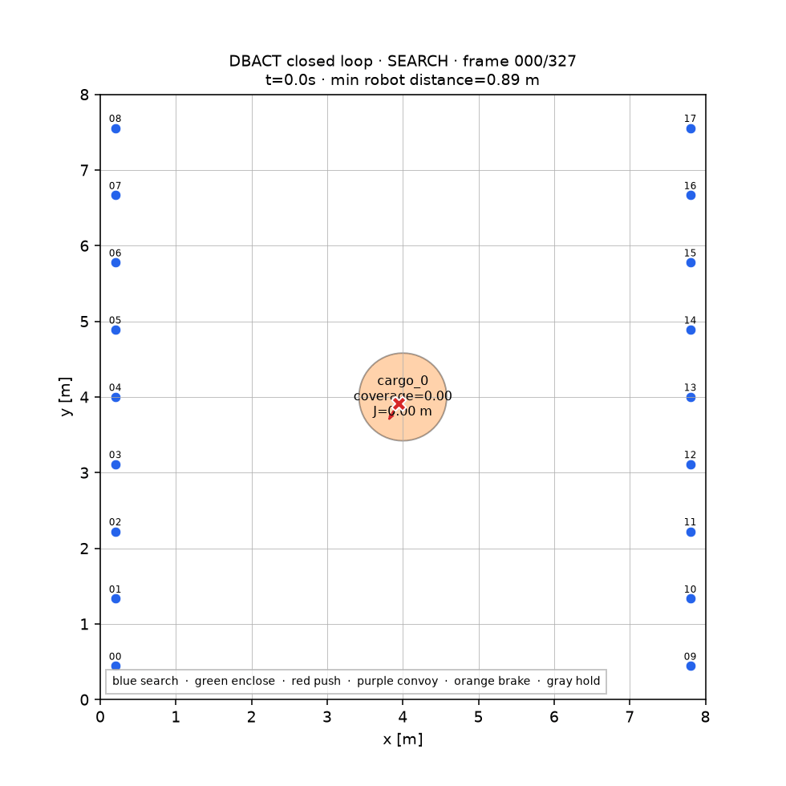
</p>

The animation is the retained truth-audited circle/seed-0 episode. A compact
H.264 version is available as
[`closed_loop.mp4`](artifacts/publication/representative/closed_loop.mp4), with
the machine-readable run record in
[`manifest.json`](artifacts/publication/representative/manifest.json).

<table>
  <tr>
    <td width="50%"><a href="artifacts/publication/representative/closed_loop_final.png">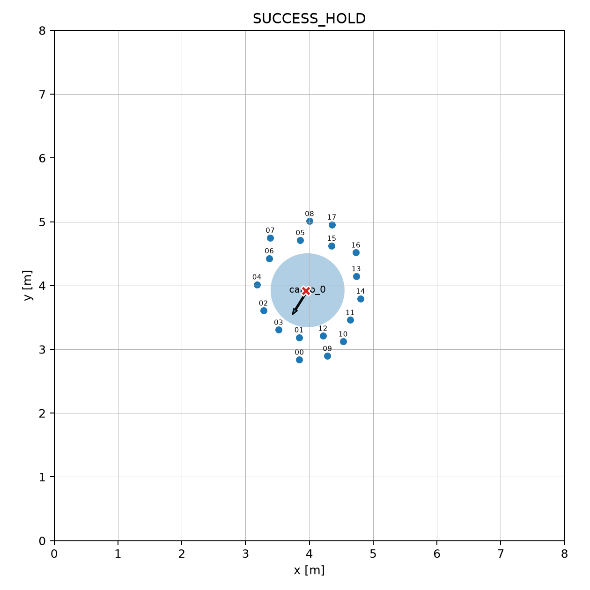</a><br><strong>Final HOLD state</strong></td>
    <td width="50%"><a href="artifacts/publication/representative/closed_loop_trajectories.png">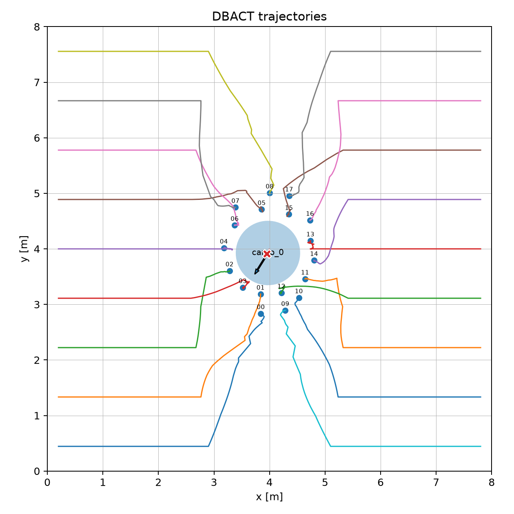</a><br><strong>Agent and cargo trajectories</strong></td>
  </tr>
</table>

---

## Closed-loop system

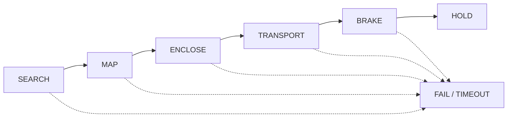
```mermaid
flowchart LR
    S["SEARCH"] --> M["MAP"] --> E["ENCLOSE"] --> T["TRANSPORT"] --> B["BRAKE"] --> H["HOLD"]
    S -.-> F["FAIL / TIMEOUT"]
    M -.-> F
    E -.-> F
    T -.-> F
    B -.-> F
```

The success path is guarded at every phase. Typical terminal classifications
include `SEARCH_TIMEOUT`, `MAP_INCOMPLETE`, `CAGE_INFEASIBLE`,
`ENCLOSURE_TIMEOUT`, `WRENCH_INFEASIBLE`, `TRANSPORT_STALL`,
`SAFETY_VIOLATION`, `SOLVER_FAILURE`, and `GOAL_CORRIDOR_INFEASIBLE`.

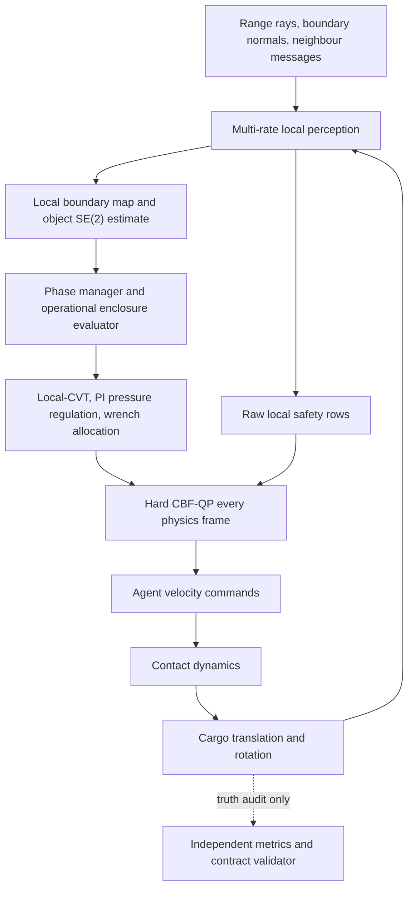
```mermaid
flowchart TB
    R["Range rays, boundary normals, neighbour messages"] --> P["Multi-rate local perception"]
    P --> L["Local boundary map and object SE(2) estimate"]
    P --> Q["Raw local safety rows"]
    L --> X["Phase manager and operational enclosure evaluator"]
    X --> C["Local-CVT, PI pressure regulation, wrench allocation"]
    C --> QP["Hard CBF-QP every physics frame"]
    Q --> QP
    QP --> A["Agent velocity commands"]
    A --> D["Contact dynamics"]
    D --> O["Cargo translation and rotation"]
    O --> P
    O -. "truth audit only" .-> V["Independent metrics and contract validator"]
```

### Progress and wrench feedback

Transport is activation-relative:

```text
J          = (x̂_object - x̂_activation)ᵀ d_goal
v_parallel = v̂_objectᵀ d_goal
e_J        = J_target - J
e_v        = v_ref - v_parallel
```

A saturated PI/adaptive-pressure controller with anti-windup regulates pushing
effort. One-hop wrench allocation seeks goal-aligned net force, near-zero net
torque, bounded cross-track motion, and bounded cargo rotation. Persistent lack
of progress is classified as `TRANSPORT_STALL`; it is not hidden by increasing
the timeout.

### Safety and moving-boundary estimation

The hard safety QP executes every physics frame even when planning and map
gossip run at lower rates. Object CBF rows use the estimated rigid boundary-point
velocity

```text
v̂_boundary(q) = v̂_object + ω̂ [-r_y, r_x].
```

Ground truth is used only for audit outputs. It never enters controller inputs.

### Operational enclosure certificate

An enclosure frame passes only when all of the following hold together:

- strict exterior-only boundary coverage passes;
- the conservative maximum uncovered boundary arc passes;
- every robot centre is outside the cargo;
- inter-agent distance is at least `d_min`;
- cage-offset geometry is feasible; and
- the engaged/contact quorum is sufficient.

This is deliberately named **operational boundary enclosure**. No
configuration-space escape proof is implemented, so `formal_caging` is reported
as `false`.

---

## Audited closed-loop witness

| Metric | Result |
|---|---:|
| termination | `SUCCESS_HOLD` |
| detection / contact / enclosure / map / transport / brake / hold frame | 136 / 205 / 233 / 268 / 282 / 307 / 327 |
| activation-relative progress `J` | 0.118668 m |
| directional efficiency | 0.998285 |
| maximum cross-track error | 0.006959 m |
| maximum absolute cargo rotation | 4.036° |
| QP solves | 5,886 |
| fallback / infeasible / rho relaxation | 0 / 0 / 0 |

### Task-space response

<table>
  <tr>
    <td width="50%"><a href="artifacts/publication/figures/05_directional_progress.png">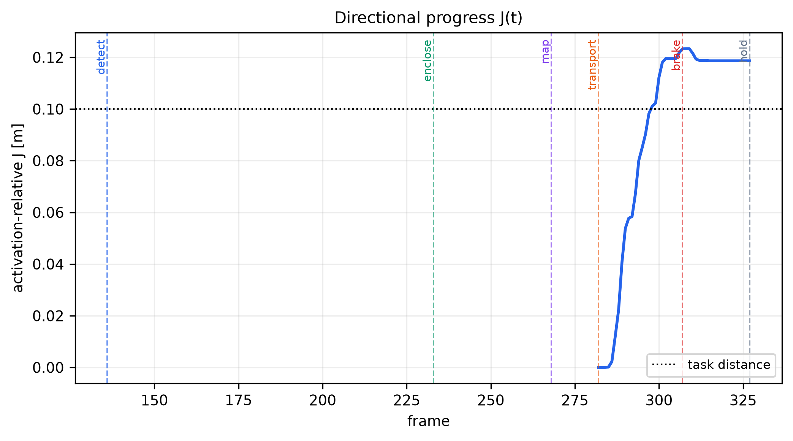</a><br><strong>Directional progress J(t)</strong> · <a href="artifacts/publication/figures/05_directional_progress.pdf">PDF</a></td>
    <td width="50%"><a href="artifacts/publication/figures/06_cross_track_error.png">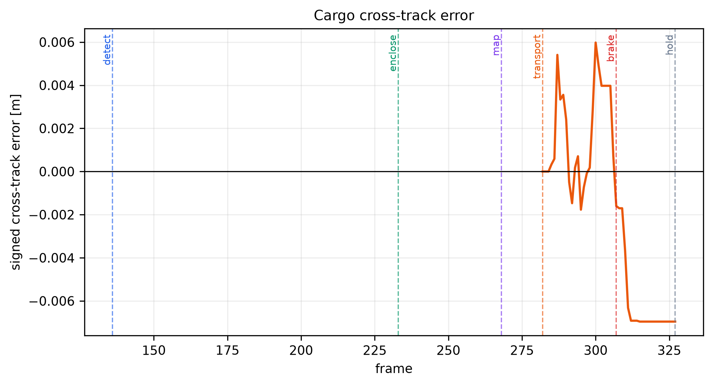</a><br><strong>Cross-track error</strong> · <a href="artifacts/publication/figures/06_cross_track_error.pdf">PDF</a></td>
  </tr>
  <tr>
    <td width="50%"><a href="artifacts/publication/figures/07_cargo_rotation.png">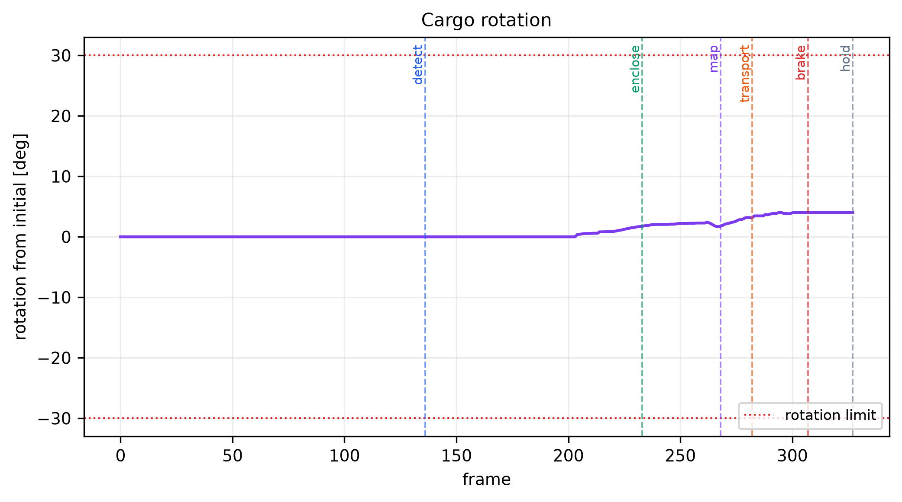</a><br><strong>Cargo rotation</strong> · <a href="artifacts/publication/figures/07_cargo_rotation.pdf">PDF</a></td>
    <td width="50%"><a href="artifacts/publication/figures/08_net_force_and_torque.png">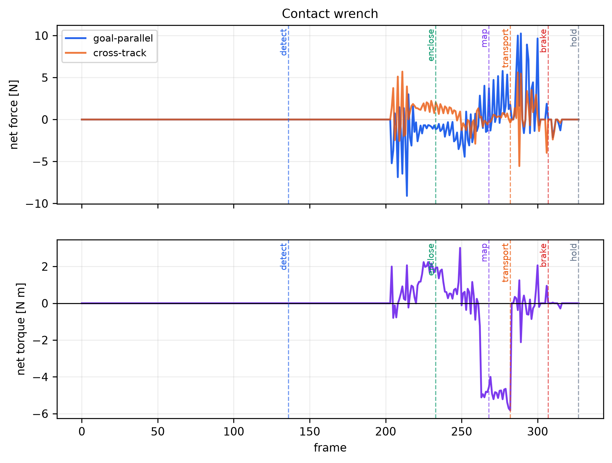</a><br><strong>Net force and torque</strong> · <a href="artifacts/publication/figures/08_net_force_and_torque.pdf">PDF</a></td>
  </tr>
  <tr>
    <td width="50%"><a href="artifacts/publication/figures/09_contact_agent_count.png">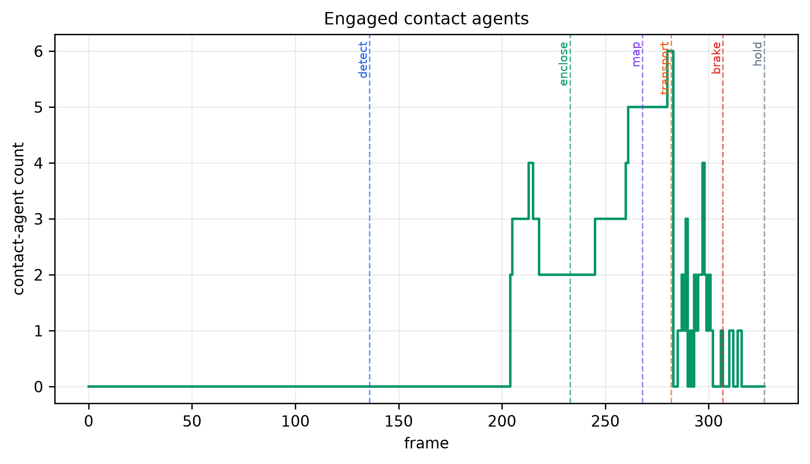</a><br><strong>Contact-agent count</strong> · <a href="artifacts/publication/figures/09_contact_agent_count.pdf">PDF</a></td>
    <td width="50%"><a href="artifacts/publication/figures/10_safety_distance_and_penetration.png">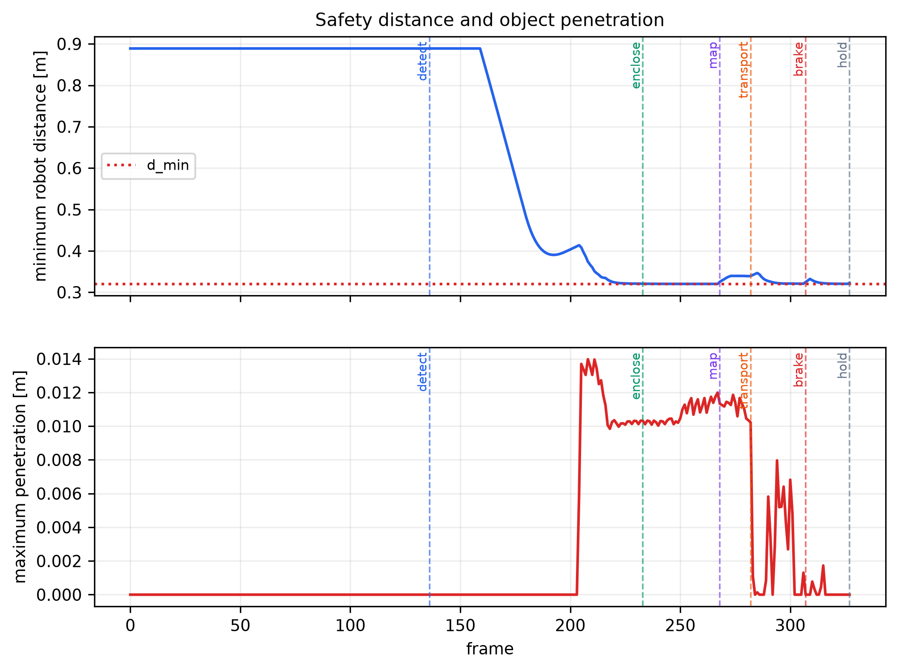</a><br><strong>Safety distance and penetration</strong> · <a href="artifacts/publication/figures/10_safety_distance_and_penetration.pdf">PDF</a></td>
  </tr>
</table>

### Measured perception and motion errors

| Audited quantity | Declared bound | p95 | Maximum | Pass |
|---|---:|---:|---:|:---:|
| boundary-point error | 0.023 m | 0.004985 m | 0.018395 m | yes |
| runtime map error | 0.270 m | 0.086891 m | 0.163481 m | yes |
| object-velocity error | 0.350 m/s | 0.090009 m/s | 0.329875 m/s | yes |
| boundary-point velocity error | 0.350 m/s | 0.155354 m/s | 0.329881 m/s | yes |
| CBF velocity-projection error | 0.350 m/s | 0.114605 m/s | 0.329867 m/s | yes |

<p align="center">
  <a href="artifacts/publication/figures/11_perception_error_distributions.png">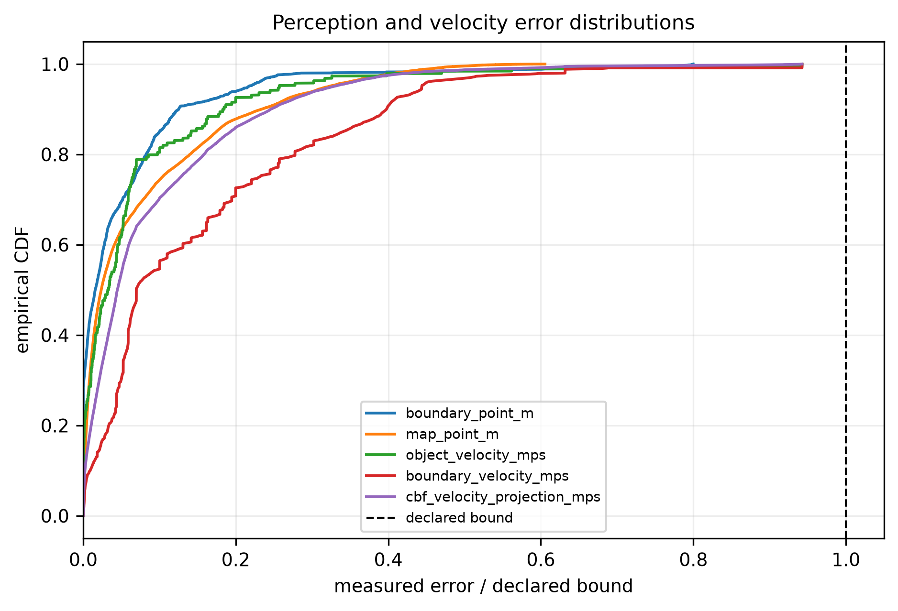</a><br>
  <strong>Measured error distributions relative to declared bounds</strong> · <a href="artifacts/publication/figures/11_perception_error_distributions.pdf">PDF</a>
</p>

The raw audit contains tens of thousands of observations and is retained in
[`perception_errors.csv`](artifacts/publication/representative/perception_errors.csv).
This table is a single audited witness, not a distribution-free guarantee.

---

## Robustness experiments

The perturbations below are injected into perception, estimation, update timing,
and communication; they are not configuration-only declarations.

| Variant | HOLD frame | `J` (m) | Efficiency | Rotation | Fallback / infeasible / rho |
|---|---:|---:|---:|---:|---:|
| nominal | 597 | 0.1643 | 0.8670 | −7.23° | 0 / 0 / 0 |
| 5 mm range noise | 447 | 0.1223 | 0.9402 | −2.15° | 0 / 0 / 0 |
| perception/planning every 5 frames | 502 | 0.1433 | 0.7793 | −5.60° | 0 / 0 / 0 |
| 10% communication dropout | 414 | 0.1313 | 0.8344 | −3.92° | 0 / 0 / 0 |
| combined perturbations | 484 | 0.1389 | 0.9162 | −8.39° | 0 / 0 / 0 |

The 10 mm range-noise stress case exceeded the boundary-error premise and timed
out. It is explicitly rejected rather than removed as an inconvenient sample.

---

## Longer-distance transport

| Requested distance | Termination | HOLD frame | `J` (m) | Efficiency | Max cross-track | Full rho margin | All declared error bounds |
|---:|---|---:|---:|---:|---:|:---:|:---:|
| 0.10 m | `SUCCESS_HOLD` | 339 | 0.0769 | 0.8584 | 0.0459 m | yes | yes |
| 0.25 m | `SUCCESS_HOLD` | 393 | 0.2293 | 0.9557 | 0.0707 m | yes | no: map error |
| 0.50 m | `SUCCESS_HOLD` | 960 | 0.4814 | 0.8989 | 0.2347 m | no: 414 relaxations | no: map error |

<p align="center">
  <a href="artifacts/publication/figures/02_success_evidence_vs_distance.png">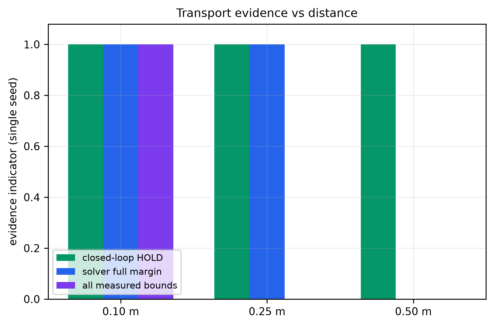</a><br>
  <strong>Success evidence versus transport distance</strong> · <a href="artifacts/publication/figures/02_success_evidence_vs_distance.pdf">PDF</a>
</p>

All three are contact-transport witnesses. Only 0.10 m currently supports the
stronger statement that every declared measured-error bound and the full rho
margin held throughout.

---

## Unscreened arbitrary-shape validation

The retained matrix executes all 60 cases before classifying theorem-domain
eligibility: 12 shape families × 5 seeds, with centre/edge/corner/random poses,
random yaw, sampled feasible transport directions, varied density, ground
friction, and contact friction. Rejected cases and failed episodes stay in the
denominator.

| Statistic | Count | Estimate | Wilson 95% interval |
|---|---:|---:|---:|
| `P(eligible)` | 7 / 60 | 0.1167 | [0.0577, 0.2218] |
| `P(success | eligible)` | 2 / 7 | 0.2857 | [0.0822, 0.6411] |
| `P(rejected)` | 53 / 60 | 0.8833 | [0.7782, 0.9423] |
| task-contract success, irrespective of eligibility | 14 / 60 | 0.2333 | — |

| Classified outcome | Count | Rejection predicate | Count |
|---|---:|---|---:|
| `SUCCESS` | 2 | contact-force capacity | 42 |
| `MAP_INCOMPLETE` | 28 | zero-torque goal-wrench feasibility | 33 |
| `WRENCH_INFEASIBLE` | 21 | runtime boundary-map epsilon | 29 |
| `CONTRACT_FAILURE` | 5 | cage-offset self-clearance | 5 |
| `SOLVER_FAILURE` | 2 | — | — |
| `CAGE_INFEASIBLE` | 2 | — | — |

Rejection predicates overlap. Across the complete matrix, 58/60 episodes are
fallback-free, 58/60 are infeasibility-free, and 55/60 retain the full rho
margin. The full matrix therefore does **not** support a zero-failure or
zero-relaxation safety claim.

### Shape and conditional-domain results

<table>
  <tr>
    <td width="50%"><a href="artifacts/publication/figures/01_success_rate_vs_shape.png">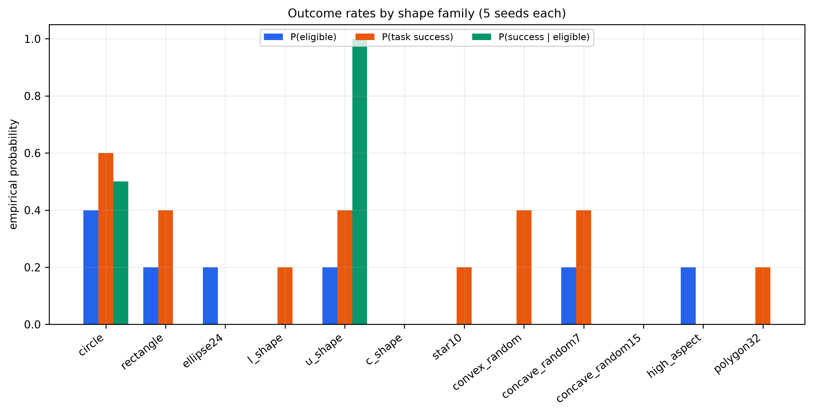</a><br><strong>Success and eligibility by shape</strong> · <a href="artifacts/publication/figures/01_success_rate_vs_shape.pdf">PDF</a></td>
    <td width="50%"><a href="artifacts/publication/figures/14_conditional_domain_statistics.png">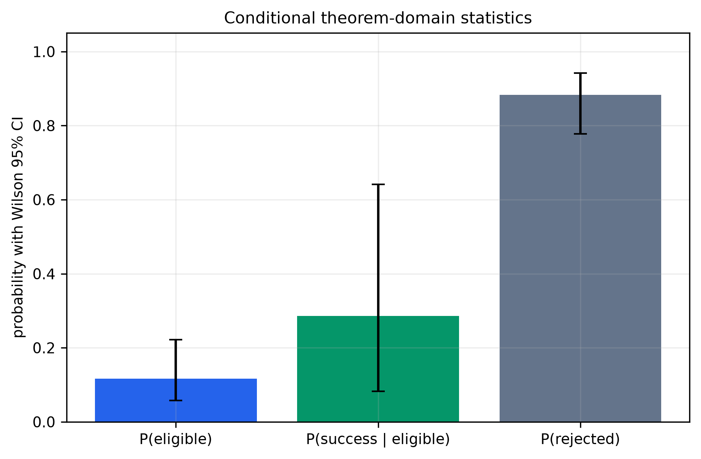</a><br><strong>Conditional-domain statistics</strong> · <a href="artifacts/publication/figures/14_conditional_domain_statistics.pdf">PDF</a></td>
  </tr>
  <tr>
    <td width="50%"><a href="artifacts/publication/figures/13_failure_composition.png">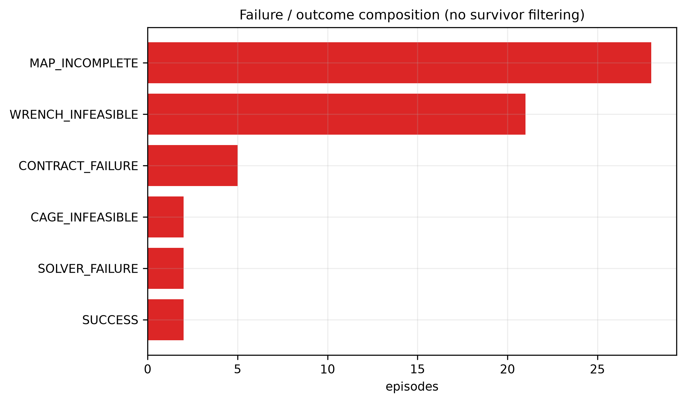</a><br><strong>Failure composition</strong> · <a href="artifacts/publication/figures/13_failure_composition.pdf">PDF</a></td>
    <td width="50%"><a href="artifacts/publication/figures/03_completion_time_distribution.png">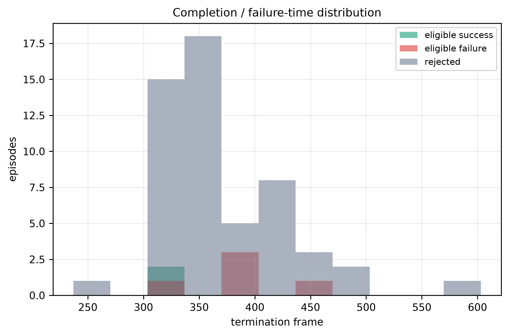</a><br><strong>Completion-frame distribution</strong> · <a href="artifacts/publication/figures/03_completion_time_distribution.pdf">PDF</a></td>
  </tr>
</table>

The per-shape table is available as
[`shape_statistics.csv`](artifacts/publication/tables/shape_statistics.csv), and
the complete records are in
[`episodes.csv`](runs/arbitrary_shape_final_se2_60/episodes.csv) and
[`monte_carlo.json`](runs/arbitrary_shape_final_se2_60/monte_carlo.json).

---

## Completion time and finite-time status

<p align="center">
  <a href="artifacts/publication/figures/04_phase_time_distributions.png">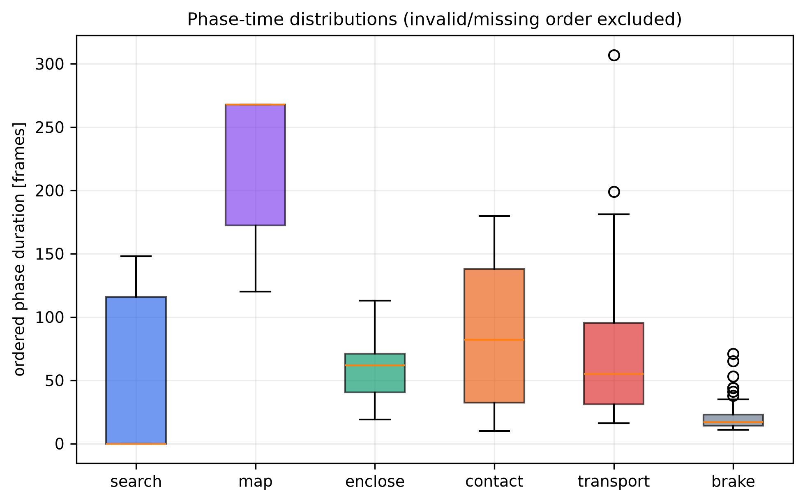</a><br>
  <strong>Observed phase-time distributions</strong> · <a href="artifacts/publication/figures/04_phase_time_distributions.pdf">PDF</a>
</p>

The conditional sufficient decomposition is

```text
T_total ≤ T_search + T_map + T_enclose + T_drive + T_brake + T_hold

T_enclose ≤ log(E0 / E_tol) / λ_e
T_drive   ≤ max(0, L - e_brake) / v_progress_min
T_brake   ≤ log(e_brake,0 / e_hold) / λ_b.
```

The algebra is valid when positive domain-wide `λ_e`, `v_progress_min`, and
`λ_b` are independently certified under the safety filter and communication
schedule. Those constants are not currently proved. Five of seven eligible
Monte Carlo episodes also fail, so an empirical maximum over the two successful
survivors would be biased. Both analytic and empirical numerical bounds therefore
return `available=false`.

---

## Runtime performance

The safety QP still executes every physics frame. The optimized pipeline batches
map re-keying, caches expiry work, reduces repeated allocations, and schedules
full map gossip only when required by the discovery proof.

| Fixed profile case | Baseline | Optimized | Change | Final classification |
|---|---:|---:|---:|---|
| circle, seed 0 | 24.30 fps | 35.49 fps | +46.07% | `SUCCESS` |
| concave random 7, seed 2 | 14.42 fps | 26.65 fps | +84.86% | `CONTRACT_FAILURE` |
| polygon 32, seed 2 | 11.25 fps | 23.15 fps | +105.78% | `MAP_INCOMPLETE` |
| **mean** | **16.65 fps** | **28.43 fps** | **+70.71%** | — |

<p align="center">
  <a href="artifacts/publication/figures/12_runtime_profiling.png">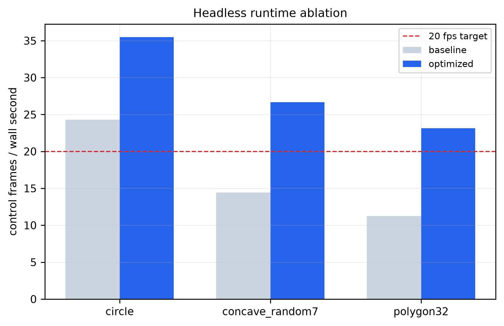</a><br>
  <strong>Headless runtime profiling</strong> · <a href="artifacts/publication/figures/12_runtime_profiling.pdf">PDF</a>
</p>

These rates are machine-dependent measurements, not portable runtime bounds.
The failed profile cases remain failed; performance optimization did not change
their thresholds or classifications.

---

## Claim ledger

| Level | Supported statement |
|---|---|
| **Mathematically proved** | Complete rectangular-workspace discovery under the stated finite-ray/lane assumptions; algebraic finite-time phase composition under positive certified contraction/progress rates; robust CBF implication when the adopted error bounds hold and the hard QP is feasible. |
| **Conditionally guaranteed** | Discovery, operational enclosure, contact transport, braking, and hold for nondegenerate simple shapes satisfying every executable geometry, map, cage, corridor, wrench, bounded-error, safety, and rate predicate. |
| **Empirically validated** | One full truth-audited closed loop; five retained perturbation variants; 0.10/0.25/0.50 m transport witnesses with explicit audit distinctions; an unscreened 60-episode matrix; and a >20 fps fixed-case performance ablation. |
| **Unsupported / remaining** | Unconditional arbitrary-simple-shape convergence; formal caging; a current positive analytic finite-time number; an empirical finite-time upper confidence bound; matrix-wide zero fallback/infeasibility/rho relaxation; persistent map-bound compliance beyond 0.10 m; and hardware validity. |

The detailed predicates and proof boundary are in
[`docs/CONDITIONAL_GUARANTEE.md`](docs/CONDITIONAL_GUARANTEE.md). The complete
research narrative is in
[`docs/FINAL_RESEARCH_REPORT_CODEX_V1.md`](docs/FINAL_RESEARCH_REPORT_CODEX_V1.md).

---

## Quick start

### Reproducible Conda environment

```bash
git clone https://github.com/Wu-kaixin/boundary-aware-cooperative-transport.git
cd boundary-aware-cooperative-transport
git switch Codex-boundary-aware-closed-loop-v1

conda env create -f environment.yml
conda activate dbact
python -m pytest -q
```

`environment.yml` installs the simulation, analysis, QP, contact-engine, and
media dependencies. MP4 export automatically uses the bundled
`imageio-ffmpeg` binary when a system ffmpeg executable is unavailable.

For an existing Python environment:

```bash
python -m pip install -e ".[qp,sim,analysis,media,dev]"
```

---

## Reproduction

### Audited representative run and animations

```bash
python scripts/run_publication_representative.py \
  --output artifacts/publication/representative \
  --animation-stride 5 \
  --animation-fps 16
```

### Actual perturbation ablation

```bash
python scripts/run_robustness_ablation.py \
  --max-steps 800 \
  --output runs/robustness_ablation_stage2
```

### Longer-distance transport

```bash
python scripts/run_distance_ablation.py \
  --distances 0.10 0.25 0.50 \
  --max-steps 1800 \
  --truth-audit \
  --output runs/distance_ablation_stage3
```

### Unscreened arbitrary-shape matrix

```bash
python scripts/run_arbitrary_shape_monte_carlo.py \
  --seeds 0..4 \
  --max-steps 1500 \
  --output runs/arbitrary_shape_final_se2_60
```

### Publication package

```bash
python scripts/generate_publication_artifacts.py \
  --monte-carlo runs/arbitrary_shape_final_se2_60/monte_carlo.json \
  --output artifacts/publication
```

| Output | Contents |
|---|---|
| [`artifacts/publication/publication_manifest.json`](artifacts/publication/publication_manifest.json) | Reproducible figure/data inventory and claim boundaries |
| [`artifacts/publication/figures/`](artifacts/publication/figures/) | 14 publication figures in PNG and deterministic PDF formats |
| [`artifacts/publication/tables/`](artifacts/publication/tables/) | Shape, phase-time, and perception-error tables |
| [`artifacts/publication/data/`](artifacts/publication/data/) | Retained aggregate JSON/CSV inputs |
| [`artifacts/publication/representative/`](artifacts/publication/representative/) | GIF, H.264 MP4, snapshots, trajectories, safety logs, cargo metrics, and raw error observations |
| [`runs/arbitrary_shape_final_se2_60/`](runs/arbitrary_shape_final_se2_60/) | Unscreened manifest, episode table, and complete aggregate records |

---

## Repository map

```text
boundary-aware-cooperative-transport/
├── configs/sim/research/              # Current closed-loop research configuration
├── src/dbact/                          # Controller, maps, guarantees, CBF-QP, metrics
├── src/dbact_sim/                      # Contact simulation, termination, audit, visualization
├── scripts/                            # Ablations, Monte Carlo, bounds, publication generation
├── tests/                              # 245 passing regression/unit tests, 3 skipped
├── docs/
│   ├── CONDITIONAL_GUARANTEE.md        # Theorem domain and explicit non-claims
│   ├── FINAL_RESEARCH_REPORT_CODEX_V1.md
│   └── results/                        # Stage-specific quantitative reports
├── artifacts/publication/              # Tracked publication package
│   ├── figures/                        # 14 PNG + 14 PDF
│   ├── tables/
│   ├── data/
│   └── representative/                 # GIF + MP4 + raw time series
├── runs/arbitrary_shape_final_se2_60/  # Retained unscreened aggregate data
├── environment.yml
└── pyproject.toml
```

### Historical material

<details>
<summary>Legacy 500-frame, Stage-1, MAS, and hardware-oriented material</summary>

The following files are preserved for provenance, comparison, and earlier
integration work. They are not the primary evidence for this branch:

- [`docs/CLOSED_LOOP_500.md`](docs/CLOSED_LOOP_500.md)
- [`docs/REFACTOR_2026-08-08.md`](docs/REFACTOR_2026-08-08.md)
- [`docs/stage1_results.md`](docs/stage1_results.md)
- [`docs/assets/README.md`](docs/assets/README.md)
- [`docs/MAS_INTEGRATION.md`](docs/MAS_INTEGRATION.md)
- [`platforms/mas_public/`](platforms/mas_public/)

| Historical moving-cargo replay | Historical density / Local-CVT view |
|---|---|
| 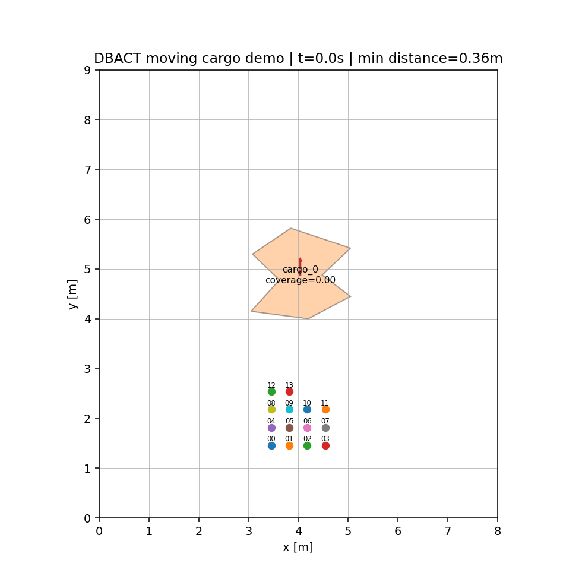 |  |

| Historical trajectories | Historical coverage curve |
|---|---|
|  | 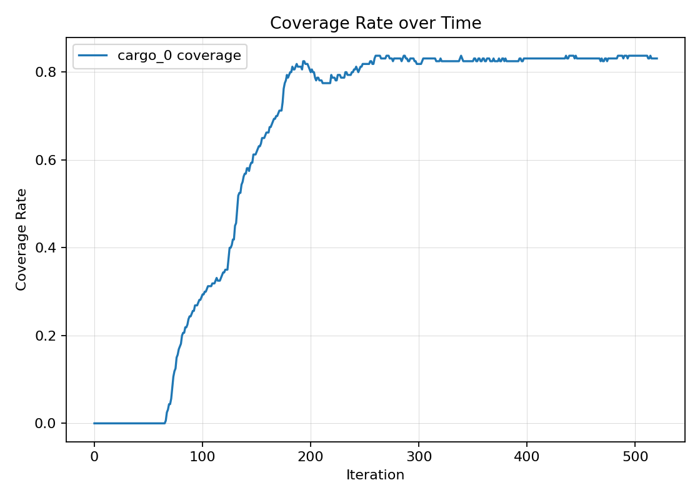 |

</details>

---

## Research integrity and safety

- Do not report only successful survivors; keep ineligible and failed episodes
  in aggregate denominators.
- Do not lower enclosure, safety, error, or task thresholds to manufacture a
  pass.
- Do not describe operational boundary enclosure as formal caging.
- Do not substitute observed completion times for unproved theoretical rate
  constants.
- Treat rho relaxation, QP infeasibility, fallback, penetration, and error-bound
  violations as first-class outputs.
- Do not infer physical-robot safety or validity from this simulation branch.

## License

DBACT is released under the [MIT License](LICENSE). Contributions should include
regression tests, reproducible configurations, raw quantitative outputs, and a
clear statement of whether each result is proved, conditional, empirical, or
unsupported.
