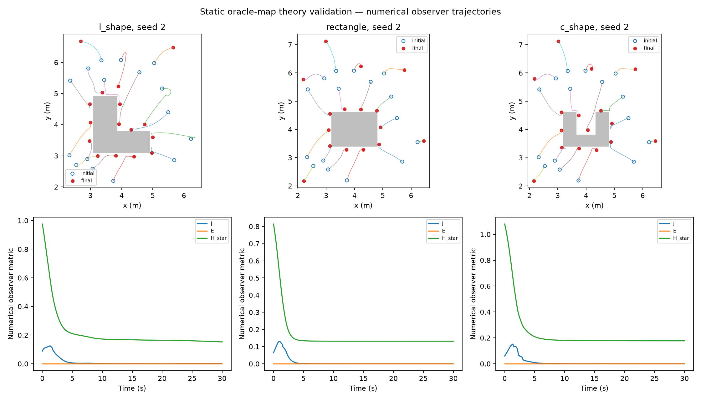

<div align="center">

# DBACT：去中心化边界感知协作搬运

搜索、包围并搬运一个形状未知的物体 —— 每一项宣称都附带一份测量。


[](https://github.com/Wu-kaixin/boundary-aware-cooperative-transport/actions/workflows/tests.yml)


</div>

## 静态安全部署：当前论文范围

**静态 oracle-map 理论验证。** 静态定理模式使用精确物体几何，包括安全滤波器。仅把质心来源改成局部地图，并不能构成「无先验几何」的安全实验。局部未知边界接口（Gate 5）以及部署对搬运的作用（Gate 6）仍是本篇论文的验收要求。端到端闭环仍是基线上下文。

当前证明与归档证据：[theory/static_deployment](theory/static_deployment/)。
其中 9 月 16 日的表与图是归档证据，不是本分支重跑。
下面生成块来自本分支 Gate 0–6。settled 与 G500 通过是两件不同的事。历史手写表格已移至 [归档说明](docs/HISTORICAL_CLOSED_LOOP_README.md)。

<!-- CONSOLIDATION_RESULTS_START -->
由已记录运行的 JSON/CSV 生成；所有种子与失败均保留。报告重建不代表重新执行仿真。

| 运行 | 帧数 | 终止 | G500 | 失败原因 |
| --- | ---: | --- | --- | --- |
| near seed 2 | 445 | settled | FAIL | G500: 3 scaled-barrier event(s), smallest factor 0.676; the contract allows 0 |
| near seed 4 | 248 | settled | PASS | — |
| near seed 8 | 352 | settled | FAIL | G500: target reached never happened within the 352-frame run; G500: J=1.1789 m stopped 0.1255 m short of L=1.3044 m, outside the declared arrival tolerance 0.1200 m |
| search seed 7 | 888 | settled | FAIL | G500: target reached never happened within the 888-frame run; G500: J=0.8900 m < target L=0.9037 m; G500: 99 scaled-barrier event(s), smallest factor 0.012; the contract allows 0 |

近场扫描种子 `[0, 1, 2, 3, 4, 5, 6, 7, 8, 9, 10, 11]`：**7/12 通过 G500**。

| 指标 | 均值 ± 总体标准差 | 最小–最大 |
| --- | ---: | ---: |
| J | 1.20977 ± 0.187161 | 0.911304–1.55259 |
| efficiency | 0.988794 ± 0.0143272 | 0.954195–0.999944 |
| direction_error_deg | 6.95319 ± 5.05877 | 0.608667–17.4086 |
| max_cross_track | 0.162624 ± 0.120949 | 0.0272753–0.435453 |
| max_strict_coverage | 0.979167 ± 0.0357521 | 0.875–1 |
| min_inter_agent_distance | 0.285139 ± 0.00547689 | 0.280117–0.296786 |
| min_signed_clearance | 0.0852181 ± 0.00972598 | 0.0700837–0.0978939 |
| contact_ready_frame | 85.5833 ± 23.6518 | 67–148 |
| hold_frame | 255.083 ± 82.7118 | 152–403 |

**D10：当前重跑结果**

发现至接触就绪共 2153 帧，其中 ENCLOSURE_CONVERGENCE 为 0 帧。


| 探索增益 | 种子数 | 接触就绪帧（均值；观测 n） | 缩放障壁事件总数 |
| --- | ---: | ---: | ---: |
| 0.0 | 8 | 590.625; n=8 | 1569 |
| 6.0 | 8 | 343.75; n=8 | 919 |


历史机制探索与旧数值见 [历史说明](docs/HISTORICAL_CLOSED_LOOP_README.md)，不用于解释本次图表。

**静态 oracle-map 理论验证**（3 种形状 × 9 个种子 × 600 帧）。
下表是已声明的严格先验量；图中 J/E/H 为数值观测器估计。

| 形状 | B_E | B_J_prior | B_J_geom | 完成 | 全程 K0 |
| --- | ---: | ---: | ---: | ---: | ---: |
| l_shape | 0.1702700924 | 0.1811413578 | 0.2295107776 | 9/9 | 9/9 |
| rectangle | 0.1287048157 | 0.1380072238 | 0.1802506048 | 9/9 | 9/9 |
| c_shape | 0.1814594174 | 0.1906267518 | 0.2295107776 | 9/9 | 9/9 |

串行/并行完整 600 帧对照（L 形与矩形，seed 2，容差 1e-12）：**PASS**。



完整 QP 状态、K0 与最小净空：[静态安全](docs/results/consolidation/static_safety.json)。

**Gate 5：局部边界接口**
成对形状：L、矩形、C；种子 2、5、8。每一对共享同一初值。
仅经验测量。真值几何只给外部评估器，不进入局部控制，也不做真值净空否决。

| 形状 | 地图 | 完成 | 终态 H（均值） | 终态质心残差²（均值） | 最小安全裕量 | 终态地图覆盖（均值） | QP 干预（均值） |
| --- | --- | ---: | ---: | ---: | ---: | ---: | ---: |
| l_shape | oracle | 3/3 | 0.15965 | 0.0035678 | 0.0021663 | 1.0000 | 0.1174 |
| l_shape | local | 3/3 | 0.15756 | 0.0058908 | -0.016768 | 1.0000 | 0.1127 |
| rectangle | oracle | 3/3 | 0.12386 | 0.0016987 | 0.0023582 | 1.0000 | 0.0871 |
| rectangle | local | 3/3 | 0.12396 | 0.002114 | -0.013497 | 1.0000 | 0.0539 |
| c_shape | oracle | 3/3 | 0.16252 | 0.0032334 | 0.0020473 | 1.0000 | 0.2264 |
| c_shape | local | 3/3 | 0.16409 | 0.007623 | -0.015039 | 1.0000 | 0.1585 |

局部运行中观测到物体安全违反的次数：**8/9**。对照完成并不构成未知边界安全定理。

[Gate 5 逐种子结果与定义](docs/results/consolidation/gate5_pairs.json)。

**Gate 6：部署对搬运的作用**
成对形状：L、矩形、C；种子 2、5、8。每一对共享同一初值。
仅替换 CONTACT_READY 之前的部署目标；感知、安全层与后续搬运保持相同。

| 形状 | 部署 | G500 通过 | 收定 | 接触就绪秒（均值；观测 n） | 接触数（均值） | 终态距离误差（均值） | QP 干预（均值） |
| --- | --- | ---: | ---: | ---: | ---: | ---: | ---: |
| l_shape | boundary_cvt | 1/3 | 3/3 | 4.05; n=3 | 2.444 | -0.06754 | 0.08075 |
| l_shape | nearest_observed_target | 0/3 | 3/3 | 11.75; n=3 | 2.074 | -0.02092 | 0.2262 |
| rectangle | boundary_cvt | 0/3 | 3/3 | 4.8; n=3 | 2.219 | -0.02013 | 0.1968 |
| rectangle | nearest_observed_target | 0/3 | 3/3 | 7.233; n=3 | 2.083 | 0.03917 | 0.23 |
| c_shape | boundary_cvt | 1/3 | 2/3 | 4.3; n=3 | 3.113 | 0.5945 | 0.1816 |
| c_shape | nearest_observed_target | 0/3 | 3/3 | 7.967; n=3 | 1.867 | 0.05147 | 0.2838 |

完整成对 JSON 含接触方位分布、观测力/力矩、法向瞬时扳手容量、方向误差、横向偏移与安全最小值。该容量是瞬时接触模型界，不是动力学保证。这些小样本对照不构成普遍的搬运优越性。

[Gate 6 逐种子结果与定义](docs/results/consolidation/gate6_pairs.json)。

[实验清单与源哈希](docs/results/consolidation/manifest.json)。
[精简结果目录](docs/results/consolidation/)。
<!-- CONSOLIDATION_RESULTS_END -->

一群移动机器人被放进一个工作空间。没有人告诉它们物体在哪里、是什么形状、多大，
也没有人告诉它们需要几台机器人才推得动。它们扫描整个工作空间直到有人看见物体、
把这个事实接力传出去、集结、围绕一个边估测边形成的边界结成笼、施力推它、
沿着抽样得到的方向把它移动抽样得到的距离、刹车、停止。

**端到端闭环模式下，控制路径使用局部感知。** 障壁行没有、速度估计没有、停止条件也没有 ——
每台机器人只依据自己的距离回波、自己的体素地图，以及一跳的邻居消息行动。

> **分支 `main`。** 闭环已端到端运行，并逐个种子测量。
> 本文件同等详细地报告「已被证实的」与「尚未被证实的」。完整推导、失败的尝试与撤回，
> 都在 [`docs/CLOSED_LOOP_D.md`](docs/CLOSED_LOOP_D.md)。

---

## 这个闭环

```text
SEARCH ──▶ DISCOVER ──▶ ENCLOSE ──▶ CONTACT_READY ──▶ TRANSPORT ──▶ BRAKE ──▶ HOLD
   │           │            │             │               │           │        │
 泳道        物体         边界感知       法定数量在       依自身速度   依自身    释放
 扫描        令牌接力     CVT 覆盖       接触带中驻留     估计施压     估计停止  围笼
```

每一次转移都是对某个**测量值**的守卫，绝不是对帧号的守卫。状态机是单调的：
每当货物脱离时包围品质都会下降，一台会回退的机器将以粘滑频率抖动。

---

## 视觉展示

| 近场闭环（seed 2） | 远场搜索（seed 7） |
| --- | --- |
|  |  |
| 发现、包围、定向搬运与停止。画面绘制的是**某一台机器人自己的边界地图**，不是真实轮廓 —— 真实轮廓画在旁边，让估测误差可见而非被隐藏。 | 十六台机器人扫描一个静态泳道分割，直到有人看见物体，接着接力传递令牌并集结。 |

| 闭环 seed 4 | 闭环 seed 8 |
| --- | --- |
|  |  |

| 静态 oracle-map 理论验证 |
| --- |
|  |
| L 形、矩形与 C 形，seed 2。定理模式使用精确物体几何，含安全滤波器。这不是局部地图安全实验。 |

模拟与绘图是分离的。一次运行只写出 `replay.npz` 而完全不绘图；图片事后由该文件产生，
所以运行所回报的帧率是**控制回路**的帧率，而不是 Matplotlib 的帧率。

---

## 快速开始

```bash
git clone https://github.com/Wu-kaixin/boundary-aware-cooperative-transport.git
cd boundary-aware-cooperative-transport
python -m venv .venv && source .venv/bin/activate      # PowerShell：.\.venv\Scripts\Activate.ps1
python -m pip install -U pip && python -m pip install -e ".[dev]"
export PYTHONPATH=src                                   # PowerShell：$env:PYTHONPATH = "src"
```

跑一个闭环回合，然后把它绘出来：

```bash
python scripts/run_closed_loop.py --seed 2 --until-settled --out runs/d_seed2
```

```bash
python scripts/render_closed_loop.py runs/d_seed2 --stride 2 --fps 25
```

远场搜索场景：

```bash
python scripts/run_closed_loop.py --config configs/sim/d/l_shape_search.yaml --seed 7 --until-settled --out runs/search_seed7
```

测试：

```bash
python -m pytest tests -q
```

---

## 再现本文件中的数字

上面每一张表都是一道指令。运行结果写进 `runs/`，该目录被 Git 忽略。

```bash
python scripts/evaluate_closed_loop.py --seeds 0..11 --until-settled --out runs/d_sweep
```

```bash
python scripts/diagnose_redeployment.py --seeds 0..7 --out runs/d10_diag
```

```bash
python scripts/ab_explore.py --seeds 0..7 --gains 0,6 --out runs/d10_ab
```

```bash
python scripts/diagnose_enclosure_gate.py --seeds 0..7 --out runs/d10_enc
```

```bash
python scripts/analyse_enclosure_gate.py --run runs/d10_enc --figure
```

合约检查，会拒绝一个控制器不可能满足的配置：

```bash
python scripts/check_contracts.py --config configs/sim/d/l_shape_search.yaml
```

---

## 运作原理

1. **射线扫描。** 模拟器产生带法向量的局部边界回波，信度由局部平面拟合残差导出。
   控制器永远不会收到多边形。
2. **地图配准。** `LocalBoundaryMap.register` 以点到面最小二乘，从机器人自己连续的
   扫描估出平移量并刚性平移地图。移动物体的世界坐标地图在物体一动就是错的；
   当所有可见法向量平行时法矩阵秩亏，这正是「只看着一个平面的机器人无法观测沿该面
   的运动」这句话的诚实表述。
3. **自由空间刻除。** 目前扫描**穿透**过去的格子会被删除。少了它，鬼影轨迹会留在真实
   表面内侧 0.06 m 处，推进中的机器人就会压在一个已不存在的边界上。
4. **边界感知密度。** 每笔观测在围笼目标 `ξ = b + d_c·n` 处贡献
   `ds · c · (1 + κ·g) · K_σ(q − ξ)`，其中 `ds` 是该回波所代表的弧长 ——
   这正是让 `φ` 成为边界上的**测度**、而不是传感器恰好产生多少样本的计数。
   自 D10 起，它也承载上述的探索项。
5. **有限范围 CVT。** 在严格圆盘 `B(p_i, R_l)` 上对截断代价 `f(r) = min(r², R_l²)`
   做移动至质心。截断是承重的：少了它，通量项不会抵消，「移动至质心是下降方向」
   这句话就直接是假的。`R_l ≤ R_comm/2` 让由通信邻居算出的胞格**等于**限制在该圆盘上的
   真实 Voronoi 胞格。
6. **搬运外回路。** 对物体沿任务方向速度的 PI 律，对静摩擦死区积分，
   积分上界由致动器极限决定而非由调参决定。
7. **CBF-QP 安全滤波。** 机器人间的行维持硬约束；物体行被过滤到机器人自己最近回波所
   指认的那个面、聚合成每面一个平滑平面、并以一个明确见证者为界限截断到速度受限的
   机器人真正能交付的量 —— 于是物体族在构造上就是可行的，而且证明它可行的那个点被指名。

---

## 项目结构

```text
boundary-aware-cooperative-transport/
├── configs/sim/d/                  # 闭环与远场搜索场景
├── src/
│   ├── dbact/                      # 控制器、感知、地图、密度、CVT、安全、合约
│   │   ├── controller.py           # S7：去中心化控制器
│   │   ├── boundary_map.py         # 配准、融合、刻除
│   │   ├── boundary_density.py     # 边界测度 + D10 探索项
│   │   ├── safety_filter.py        # CBF-QP，四层求解
│   │   ├── phase.py                # 带驻留的单调状态机
│   │   ├── diagnosis.py            # D10-DIAG：发现后阶段分段
│   │   └── enclosure_gate.py       # D10-ENC：共识包围证书（未采用）
│   ├── dbact_sim/                  # 环境、场景、重放、绘图
│   └── mas_adapter/                # MAS 兼容控制器转接层
├── scripts/                        # 运行、扫描、诊断、A/B、合约检查
├── docs/
│   ├── CLOSED_LOOP_D.md            # 完整记述：推导、失败、撤回
│   ├── ALGORITHM.md · ARCHITECTURE.md · MAS_INTEGRATION.md
│   └── assets/                     # Git 跟踪、可在 GitHub 呈现的媒体
├── platforms/mas_public/           # 内嵌的 MAS 平台代码
├── tests/                          # pytest；数量以 CI 为准，不在此手写
└── runs/                           # 本地输出，被 Git 忽略
```

---

## 硬件分阶段与安全

通往实体实验的路径是刻意分阶段的：DBACT 模拟 → MAS 空跑 → OptiTrack 只读记录 →
RoboMaster S1 指令冒烟测试。见 [`docs/MAS_INTEGRATION.md`](docs/MAS_INTEGRATION.md)。

- 在启用任何控制器输出之前，先跑 OptiTrack 只读记录。
- 一次一台地验证机器人 ID 与刚体的对应。
- 第一次实体运行请使用非常低的速度上限。
- 硬件测试期间保持实体急停可用。
- 每次运行后检查指令与状态记录。

---

## 延伸阅读

| 文件 | 内容 |
| --- | --- |
| [`docs/CLOSED_LOOP_D.md`](docs/CLOSED_LOOP_D.md) | 本分支的完整记述，包含每一个测量后被否决的机制 |
| [`docs/ALGORITHM.md`](docs/ALGORITHM.md) | 密度、CVT 与安全的推导 |
| [`docs/ARCHITECTURE.md`](docs/ARCHITECTURE.md) | 模块边界与数据流 |
| [`docs/MAS_INTEGRATION.md`](docs/MAS_INTEGRATION.md) | 转接层、空跑与硬件分阶段 |

---

## 贡献与许可

欢迎通过 Issue 与 Pull Request 贡献。这里最有价值的贡献是**测量**：
一个能推翻既有宣称的场景、一个容差设错的判据，或是一个被尝试过、
即使没有成效也被诚实回报的机制。

本项目以 [MIT License](LICENSE) 发布。
