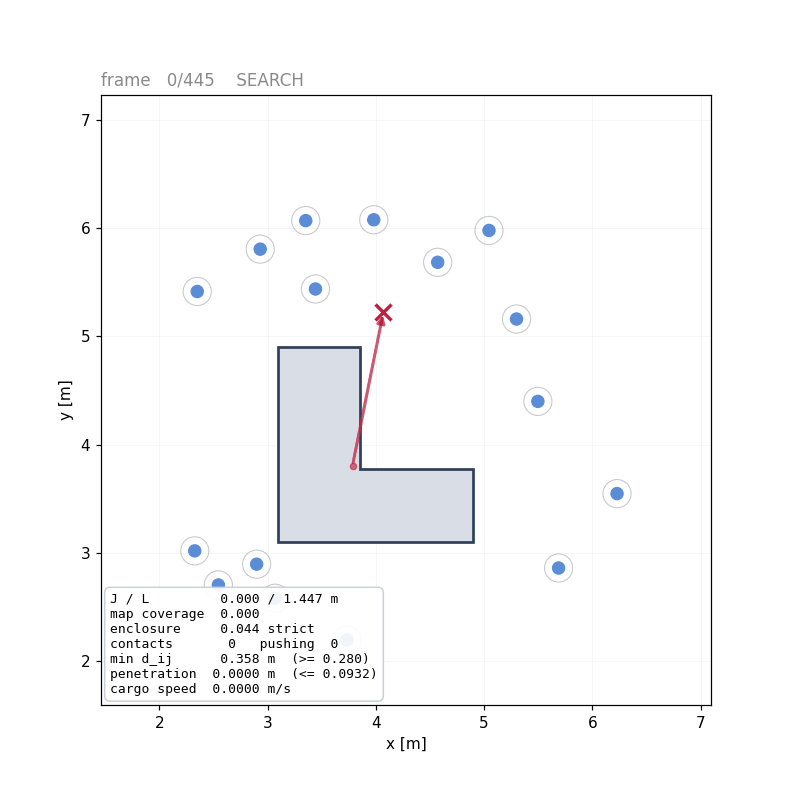
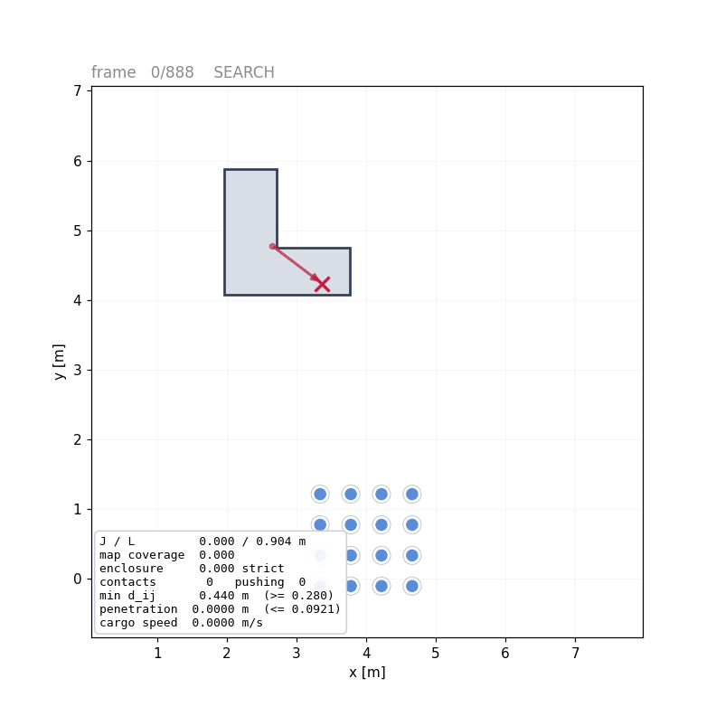
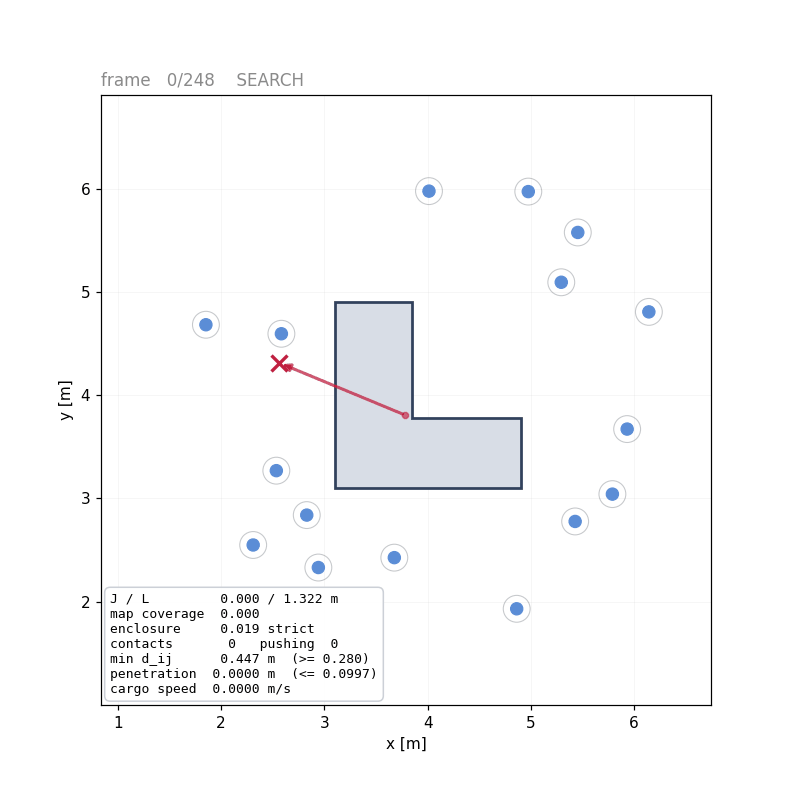
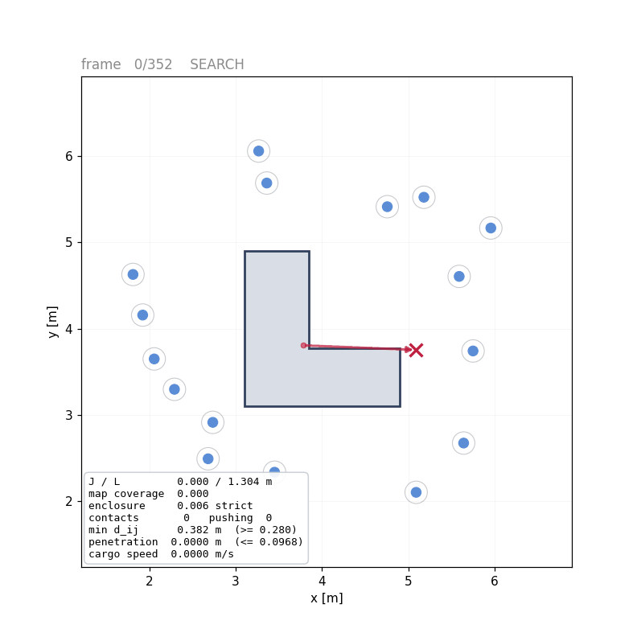
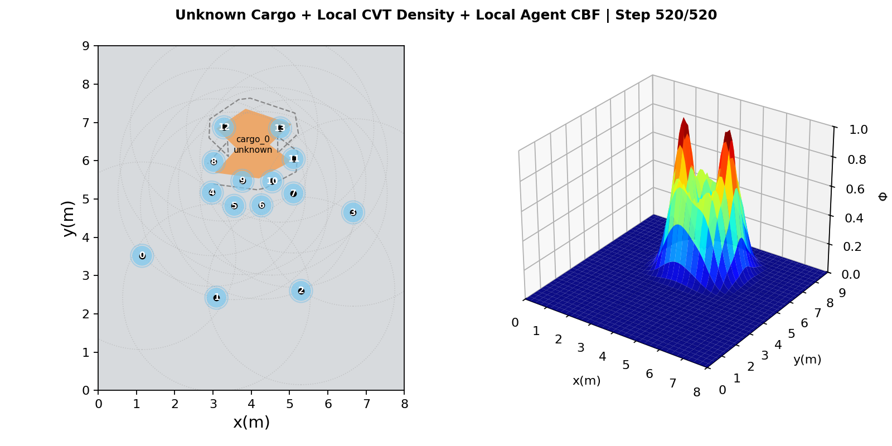
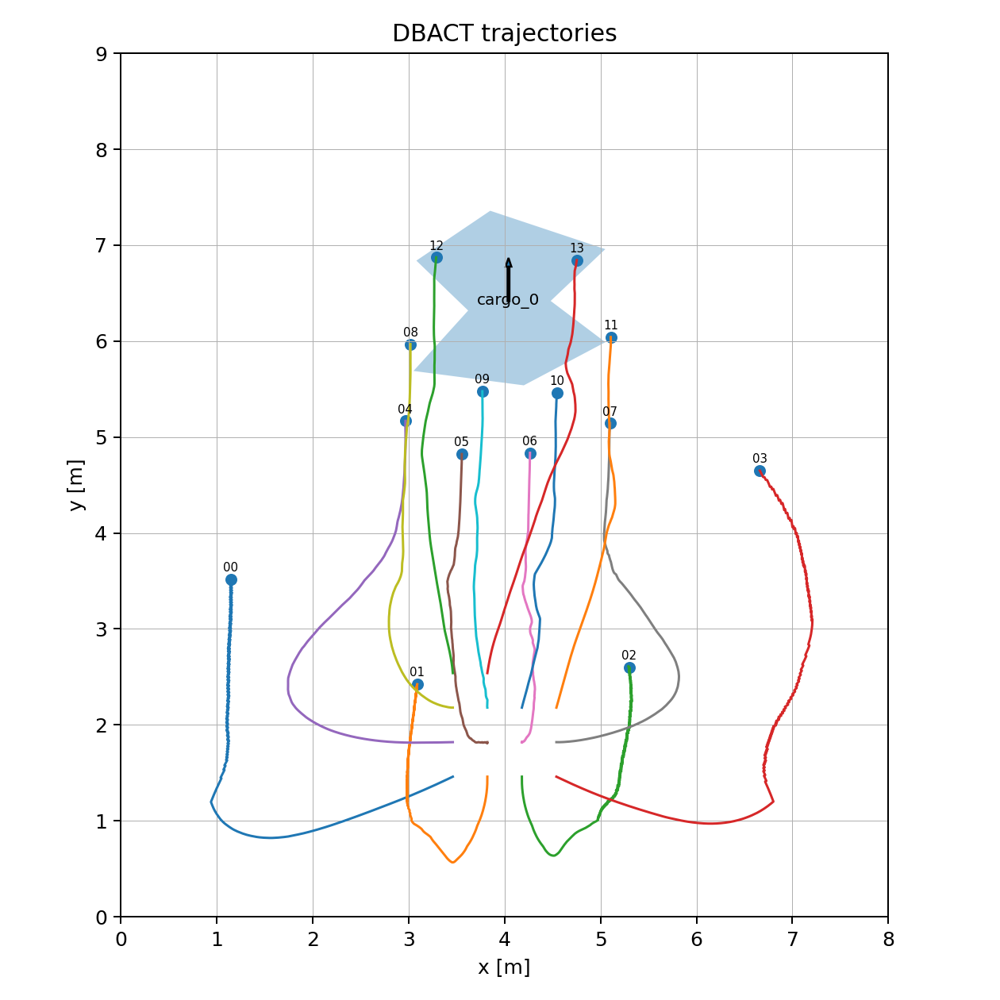
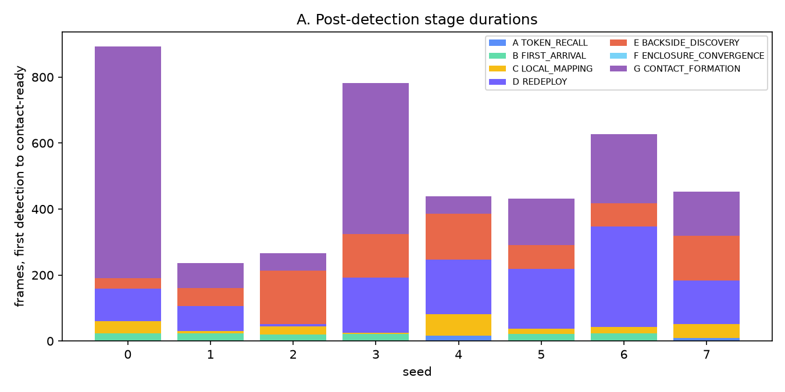
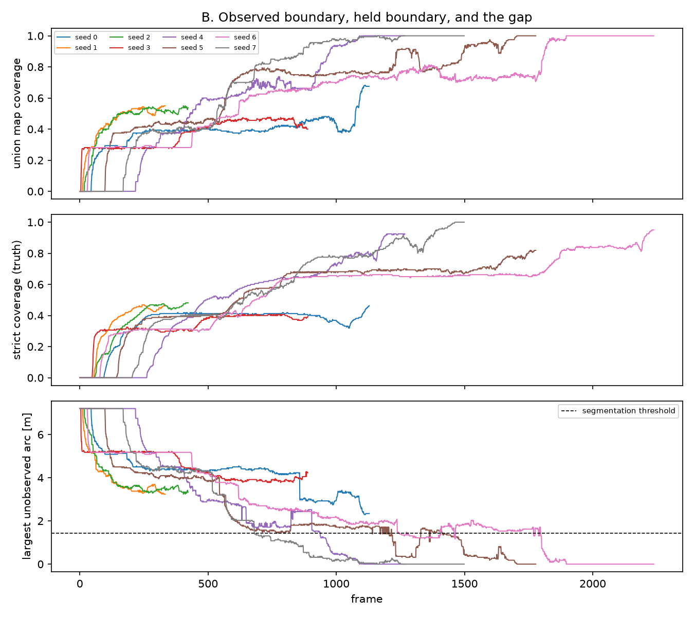
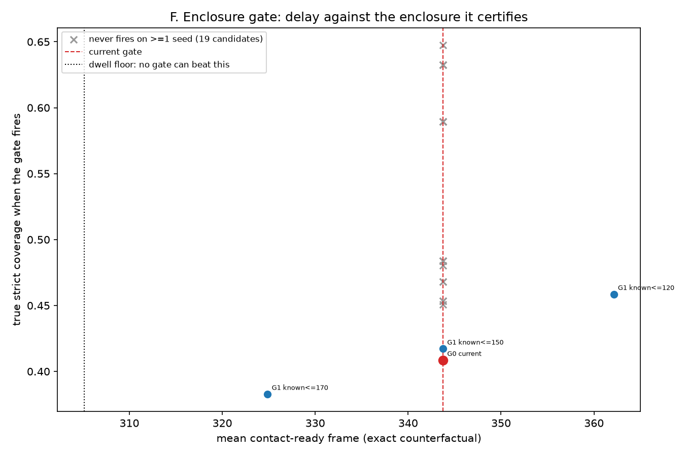

<div align="center">

# DBACT：去中心化邊界感知協作搬運

搜尋、包圍並搬運一個形狀未知的物體 —— 每一項宣稱都附帶一份量測。

[English](README.md) | [繁體中文](README.zh-TW.md) | [日本語](README.ja.md)


</div>

一群移動機器人被放進一個工作空間。沒有人告訴它們物體在哪裡、是什麼形狀、多大，
也沒有人告訴它們需要幾台機器人才推得動。它們掃描整個工作空間直到有人看見物體、
把這個事實接力傳出去、集結、圍繞一個邊估測邊形成的邊界結成籠、施力推它、
沿著抽樣得到的方向把它移動抽樣得到的距離、煞車、停止。

**控制路徑上沒有任何一處讀取模擬器。** 障壁列沒有、速度估測沒有、停止條件也沒有 ——
每台機器人只依據自己的距離回波、自己的體素地圖，以及一跳的鄰居訊息行動。

> **分支 `Claude-boundary-aware-closed-loop-v1`。** 閉環已端到端運作，並逐個種子量測。
> 本文件同等詳細地報告「已被證實的」與「尚未被證實的」。完整推導、失敗的嘗試與撤回，
> 都在 [`docs/CLOSED_LOOP_D.md`](docs/CLOSED_LOOP_D.md)。

---

## 這個閉環

```text
SEARCH ──▶ DISCOVER ──▶ ENCLOSE ──▶ CONTACT_READY ──▶ TRANSPORT ──▶ BRAKE ──▶ HOLD
   │           │            │             │               │           │        │
 泳道        物體         邊界感知       法定數量在       依自身速度   依自身    釋放
 掃描        令牌接力     CVT 覆蓋       接觸帶中駐留     估測施壓     估測停止  圍籠
```

每一次轉移都是對某個**量測值**的守衛，絕不是對幀號的守衛。狀態機是單調的：
每當貨物脫離時包圍品質都會下降，一台會回退的機器將以黏滑頻率抖動。

---

## 視覺展示

| 近場閉環（seed 2） | 遠場搜尋（seed 7） |
| --- | --- |
|  |  |
| 發現、包圍、定向搬運與停止。畫面繪製的是**某一台機器人自己的邊界地圖**，不是真實輪廓 —— 真實輪廓畫在旁邊，讓估測誤差可見而非被隱藏。 | 十六台機器人掃描一個靜態泳道分割，直到有人看見物體，接著接力傳遞令牌並集結。 |

| 閉環 seed 4 | 閉環 seed 8 |
| --- | --- |
|  |  |

| 密度與局部 CVT | 機器人軌跡 |
| --- | --- |
|  |  |

模擬與繪圖是分離的。一次執行只寫出 `replay.npz` 而完全不繪圖；圖片事後由該檔產生，
所以執行所回報的幀率是**控制迴路**的幀率，而不是 Matplotlib 的幀率。

---

## 已被證實的部分

### 近場：包圍與定向搬運，12 個種子，跑到完成

`configs/sim/d/l_shape_closed_loop.yaml`。團隊起始就分佈在物體周圍。每一回合各自抽樣
任務：方向 `θ ~ U(0, 2π)`、距離 `L ~ U(0.90, 1.60)` m，若物體與其圍籠在終點放不進
工作空間則拒絕重抽。**十二個種子全部收斂穩定；沒有任何一個觸發看門狗。**

| 量 | 平均 ± 標準差 | 最小–最大 | 判準 |
| --- | --- | --- | --- |
| 定向進程 `J` | 1.474 ± 0.231 m | 1.110 – 1.853 | `>= L`，12/12 |
| 效率 `J/‖dx‖` | 0.993 ± 0.008 | 0.975 – 1.000 | `>= 0.80`，通過 |
| 方向誤差 | 5.8 ± 3.9° | 1.3 – 12.9 | `<= 20°`，通過 |
| 橫向偏移 | 0.161 ± 0.122 m | 0.037 – 0.387 | `<= 0.15`，**5 個超標** |
| 嚴格覆蓋率（峰值） | 0.981 ± 0.027 | 0.938 – 1.000 | `>= 0.70`，通過 |
| 最小機器人間距 | 0.281 ± 0.002 m | 0.280 – 0.285 | `>= 0.28`，通過 |
| 最小帶號間隙 | 0.085 ± 0.005 m | 0.077 – 0.092 | `>= 0`，通過 |
| 接觸就緒幀 | 75.5 ± 8.4 | 57 – 89 | 導出 |
| HOLD 幀 | 274.0 ± 102.0 | 169 – 530 | 導出 |

求解器：**每個種子都是 0 次回退、0 次不可行。** 複合判準（`G500`，所有條件同時成立）
通過 **2 / 12**；十個失敗中，五個只敗在縮放障壁、一個只敗在橫向偏移，其餘每一項條件
在十二個種子上都通過。

### 遠場：團隊找到一個從未被告知的物體，8 個種子

`configs/sim/d/l_shape_search.yaml`。貨物中心在工作空間允許處任意抽樣，而
`require_initial_ignorance` 會拒絕任何「有機器人起始就落在自己感測範圍內」的抽樣 ——
因此偵測時間量測的是**搜尋**而不是佈局。

第 `i` 台機器人擁有一條垂直泳道並從頭走到尾。7.1 m 寬度上的十六條泳道，對上 1.20 m
的感測半徑，代表工作空間中每一點都落在某台機器人的掃幅內，因此單趟走完即可覆蓋：

```text
T_cover  <=  ( d_to_lane + H ) / v_search  =  ( <=4 + 7.1 ) / 0.28  ~  510 幀
```

這是一個與物體位置無關的覆蓋**上界** —— 先前的向外螺旋無法提供這種保證。

| 量 | 量測值 |
| --- | --- |
| `T_detect` | **74.6 ± 80.3 幀**，對上 ~510 幀的上界 |
| `T_contact_ready` | 344 ± 135 幀 |
| 嚴格覆蓋率峰值 | 0.783 ± 0.214 |
| `d_min` 違反 / 看門狗 / 求解器回退 | **0 / 0 / 0** |

偵測大約落在最壞情況的七分之一：物體通常不在最後才走到的那條泳道。每個種子都偵測到，
且每一回合都以穩定收斂而非看門狗結束。

---

## 值得一讀的部分：遠場落差是怎麼被縮小的

從單側牆邊抵達，過去需要 **591 ± 234** 幀才達到接觸就緒，而從圍籠起始只需
**75 ± 8** 幀。三種機制被實作並量測 —— 環形方位、修正外延後的環形方位、
兩種偵察密度下的沿牆行走 —— **沒有任何一種贏過單純的直接前往召回。**
它們改的都是「進場路上機器人往哪走」，而那些幀是被一支**已經抵達**的隊伍花掉的。

所以下一步是儀器化，不是第四個啟發式。



從偵測到接觸就緒之間的每一幀，都由一個對量測狀態的互斥級聯來標記。這條流水線原本
設計圍繞的那個階段 —— *法定數量已抵達且邊界已建圖* —— **從未出現：4128 幀中有 0 幀。**



原因就在一個量測裡：**7.2 m 周長中有 4.34 ± 0.79 m 自始至終不在任何機器人的地圖裡，
而且從未低於 0.72 m。** 重新部署規則有 84.5% 的請求得不到任何候選 ——
不是因為邊界已被佔有，而是因為它根本不在那裡。

這與可以直接從原始碼讀出的事實一致。對一台地圖非空的機器人而言，抵達後控制路徑上的
*每一個*目標 —— CVT 質心、接近目標、重新部署目標 —— 都是自身地圖點的仿射函數，
因此可達目標集合被包含在**已觀測**邊界的偏移環內。控制器不可能索求任何人都沒看過的邊界。

**修正是同一個密度裡的一項**，不是新的導航律：

```text
φ  =  φ_boundary  +  λ_e · φ_explore
```

`φ_explore` 把需求放在已觀測範圍末端往切線方向再走一步的位置。它不需要物體半徑、
不需要形狀先驗、不需要真值多邊形；它會自行關閉（在完整建圖的輪廓上剛好增加零個目標）；
而且它是一個**密度**項，所以由既有的有限範圍 CVT 決定誰去 ——
沒有人進入新模式，安全層也永遠看不到它。

| A/B，8 個種子，只差一個參數 | `λ_e = 0` | `λ_e = 6` |
| --- | --- | --- |
| 背面發現 | 281 ± 284 | **82 ± 42** |
| 接觸就緒 | 591 ± 234 | **344 ± 135** |
| HOLD | 1131 ± 646 | **642 ± 284** |
| 嚴格覆蓋率峰值 | 0.689 ± 0.256 | **0.783 ± 0.214** |
| 最小機器人間距 / 看門狗 / 回退 | 0.280 / 0 / 0 | 0.280 / 0 / 0 |
| 縮放障壁事件 | 1415 | **975** |

八個種子中有七個變好；**有一個變差了 128 幀**，並且被記錄下來而非被平均掩蓋。

**增益是由求解器選的，不是由碼錶選的。** 接觸就緒一路到 `λ_e = 60` 都還在變好，
但在 `λ_e = 20` 時，三個種子中有兩個違反機器人間障壁（0.207 與 0.213 m，對上
`d_min = 0.28`），並出現 **589 次不可行求解**，而 `λ_e = 6` 是零次。
探索需求把機器人拉離圍籠環；超過某個權重之後，它拉的力量就大於分離項能維持的間距。

### 一個被保留下來的否定結果



`DISCOVER → ENCLOSE` 守衛讀的是**單一台最佳機器人**自己的地圖。這看起來就不是一個
團隊級宣稱該用的量，因此四個系列的替代方案被實作 —— 包含一個免參考點的包圍證書，
基於對已觀測邊界**法向量**的極大值共識，那才是真正意味著「對每一個方向，都有人站在
與之對抗的面上」的量。

因為控制路徑上沒有任何一處讀取 `ENCLOSE`，反事實是**精確的**而不是篩選：

```text
T_contact_ready  =  max( T_gate, T_streak20 )  -  1        （8 個種子殘差皆為 0）
```

這替整件事設下硬上限：**一個在第 0 幀就觸發的神諭門檻，也只能從 343.8 幀省下
38.6 幀 —— 11.2%。** 每一個具有真實包圍內涵的候選，都至少在一個種子上從未觸發，
而在單調狀態機下那是死鎖而非延遲。因此門檻**維持不變**，該證書留在程式庫中、
有測試但未被採用，因為誠實的量測結果是：今天採用它會讓八個回合中有兩個死鎖。

那張圖的右下角 —— 更早**且**認證了真實包圍 —— 是空的。這就是結果。

---

## **尚未**被證實的部分

寫得和結果一樣直白，因為一份只列出勝績的說明文件不構成任何證據。

- **遠場複合判準在 8 個種子上通過 0 個。** 發現與包圍改善了；品質類條件
  （尤其是橫向偏移）沒有，而 D10 也沒有針對它們。
- **橫向偏移是近場的主要失敗項。** 在十二個種子上量測，
  `max cross-track = J · sin(方向誤差)`，相關係數 0.968 —— 所以在 `J ≈ 1.5 m` 時
  「橫向偏移 ≤ 0.15 m」*就是*「在整段推進中把合力方向維持在 5.7° 以內」。
  量到的方向誤差是 5.71°：這個迴路正好坐在它自己的要求上，這是**權限已達極限**
  的迴路的特徵，而不是沒調好的迴路。
- **某些目標方向永遠形不成推進法定數量**，因為那些方向的尾隨弧正好是 L 形的凹缺口。
- **機載進程估測系統性偏低** 約 10–15%，所以在團隊自己的估測說「到了」之前，
  貨物其實已經走過頭。
- **只估測平移，不估測偏航。** 這是明說的限制而非近似：該估測會進入安全約束，
  在沒有誤差界的情況下宣稱 SE(2) 等於把一個未量測的量放進障壁裡。
- **只有一種形狀。** 這裡的一切都是尺度 1.5 的 L 形。
- **沒有實體搬運。** 模擬與 MAS 空跑路徑可運作；硬體仍是分階段驗證的目標。

### 已撤回

本文件的較早版本曾報告八個遠場種子中有四個違反 `d_min`。那是錯的：該判準用精確浮點
比較去對上一個**設計上就恰好緊繃**的障壁，於是把 QP 算術的最後一位元報成了碰撞。
實測虧空是 1e-16 到 3e-8 m。三十五奈米不是碰撞。這個錯誤的代價是一輪針對從未發生過的
安全問題所做的工作，所以這個教訓被記錄下來而不是被悄悄修掉：
**對一個被控制器主動推到極限的量所設的判準，其容差必須以算術精度為尺度。**

在物體邊界障壁存在之前量到的每一個覆蓋率數字也一併撤回，因為當時站在貨物**內部**的
機器人也被算作覆蓋了它的邊界。關掉障壁時，16 台中有 9 台最後在物體內部，而舊指標
仍然報告 1.000。上面所有覆蓋率都是**嚴格**覆蓋率，只計算中心在貨物外部的機器人。

---

## 快速開始

```bash
git clone https://github.com/Wu-kaixin/boundary-aware-cooperative-transport.git
cd boundary-aware-cooperative-transport
python -m venv .venv && source .venv/bin/activate      # PowerShell：.\.venv\Scripts\Activate.ps1
python -m pip install -U pip && python -m pip install -e ".[dev]"
export PYTHONPATH=src                                   # PowerShell：$env:PYTHONPATH = "src"
```

跑一個閉環回合，然後把它繪出來：

```bash
python scripts/run_closed_loop.py --seed 2 --until-settled --out runs/d_seed2
```

```bash
python scripts/render_closed_loop.py runs/d_seed2 --stride 2 --fps 25
```

遠場搜尋場景：

```bash
python scripts/run_closed_loop.py --config configs/sim/d/l_shape_search.yaml --seed 7 --until-settled --out runs/search_seed7
```

測試：

```bash
python -m pytest tests -q
```

---

## 重現本文件中的數字

上面每一張表都是一道指令。執行結果寫進 `runs/`，該目錄被 Git 忽略。

```bash
python scripts/evaluate_closed_loop.py --seeds 0..11 --until-settled --out runs/d_sweep
```

```bash
python scripts/diagnose_redeployment.py --seeds 0..7 --out runs/d10_diag
```

```bash
python scripts/ab_explore.py --seeds 0..7 --gains 0,6 --out runs/d10_ab
```

```bash
python scripts/diagnose_enclosure_gate.py --seeds 0..7 --out runs/d10_enc
```

```bash
python scripts/analyse_enclosure_gate.py --run runs/d10_enc --figure
```

合約檢查，會拒絕一個控制器不可能滿足的組態：

```bash
python scripts/check_contracts.py --config configs/sim/d/l_shape_search.yaml
```

---

## 運作原理

1. **射線掃描。** 模擬器產生帶法向量的局部邊界回波，信賴度由局部平面擬合殘差導出。
   控制器永遠不會收到多邊形。
2. **地圖配準。** `LocalBoundaryMap.register` 以點到面最小平方，從機器人自己連續的
   掃描估出平移量並剛性平移地圖。移動物體的世界座標地圖在物體一動就是錯的；
   當所有可見法向量平行時法矩陣秩虧，這正是「只看著一個平面的機器人無法觀測沿該面
   的運動」這句話的誠實表述。
3. **自由空間刻除。** 目前掃描**穿透**過去的格子會被刪除。少了它，鬼影軌跡會留在真實
   表面內側 0.06 m 處，推進中的機器人就會壓在一個已不存在的邊界上。
4. **邊界感知密度。** 每筆觀測在圍籠目標 `ξ = b + d_c·n` 處貢獻
   `ds · c · (1 + κ·g) · K_σ(q − ξ)`，其中 `ds` 是該回波所代表的弧長 ——
   這正是讓 `φ` 成為邊界上的**測度**、而不是感測器恰好產生多少樣本的計數。
   自 D10 起，它也承載上述的探索項。
5. **有限範圍 CVT。** 在嚴格圓盤 `B(p_i, R_l)` 上對截斷代價 `f(r) = min(r², R_l²)`
   做移動至質心。截斷是承重的：少了它，通量項不會抵消，「移動至質心是下降方向」
   這句話就直接是假的。`R_l ≤ R_comm/2` 讓由通訊鄰居算出的胞格**等於**限制在該圓盤上的
   真實 Voronoi 胞格。
6. **搬運外迴路。** 對物體沿任務方向速度的 PI 律，對靜摩擦死區積分，
   積分上界由致動器極限決定而非由調參決定。
7. **CBF-QP 安全濾波。** 機器人間的列維持硬約束；物體列被過濾到機器人自己最近回波所
   指認的那個面、聚合成每面一個平滑平面、並以一個明確見證者為界限截斷到速度受限的
   機器人真正能交付的量 —— 於是物體族在構造上就是可行的，而且證明它可行的那個點被指名。

---

## 專案結構

```text
boundary-aware-cooperative-transport/
├── configs/sim/d/                  # 閉環與遠場搜尋場景
├── src/
│   ├── dbact/                      # 控制器、感知、地圖、密度、CVT、安全、合約
│   │   ├── controller.py           # S7：去中心化控制器
│   │   ├── boundary_map.py         # 配準、融合、刻除
│   │   ├── boundary_density.py     # 邊界測度 + D10 探索項
│   │   ├── safety_filter.py        # CBF-QP，四層求解
│   │   ├── phase.py                # 帶駐留的單調狀態機
│   │   ├── diagnosis.py            # D10-DIAG：發現後階段分段
│   │   └── enclosure_gate.py       # D10-ENC：共識包圍證書（未採用）
│   ├── dbact_sim/                  # 環境、場景、重播、繪圖
│   └── mas_adapter/                # MAS 相容控制器轉接層
├── scripts/                        # 執行、掃描、診斷、A/B、合約檢查
├── docs/
│   ├── CLOSED_LOOP_D.md            # 完整記述：推導、失敗、撤回
│   ├── ALGORITHM.md · ARCHITECTURE.md · MAS_INTEGRATION.md
│   └── assets/                     # Git 追蹤、可在 GitHub 呈現的媒體
├── platforms/mas_public/           # 內嵌的 MAS 平台程式碼
├── tests/                          # 287 個測試
└── runs/                           # 本機輸出，被 Git 忽略
```

---

## 硬體分階段與安全

通往實體實驗的路徑是刻意分階段的：DBACT 模擬 → MAS 空跑 → OptiTrack 唯讀記錄 →
RoboMaster S1 指令冒煙測試。見 [`docs/MAS_INTEGRATION.md`](docs/MAS_INTEGRATION.md)。

- 在啟用任何控制器輸出之前，先跑 OptiTrack 唯讀記錄。
- 一次一台地驗證機器人 ID 與剛體的對應。
- 第一次實體執行請使用非常低的速度上限。
- 硬體測試期間保持實體急停可用。
- 每次執行後檢查指令與狀態記錄。

---

## 延伸閱讀

| 文件 | 內容 |
| --- | --- |
| [`docs/CLOSED_LOOP_D.md`](docs/CLOSED_LOOP_D.md) | 本分支的完整記述，包含每一個量測後被否決的機制 |
| [`docs/ALGORITHM.md`](docs/ALGORITHM.md) | 密度、CVT 與安全的推導 |
| [`docs/ARCHITECTURE.md`](docs/ARCHITECTURE.md) | 模組邊界與資料流 |
| [`docs/MAS_INTEGRATION.md`](docs/MAS_INTEGRATION.md) | 轉接層、空跑與硬體分階段 |

---

## 貢獻與授權

歡迎透過 Issue 與 Pull Request 貢獻。這裡最有價值的貢獻是**量測**：
一個能推翻既有宣稱的場景、一個容差設錯的判準，或是一個被嘗試過、
即使沒有成效也被誠實回報的機制。

本專案以 [MIT License](LICENSE) 釋出。
