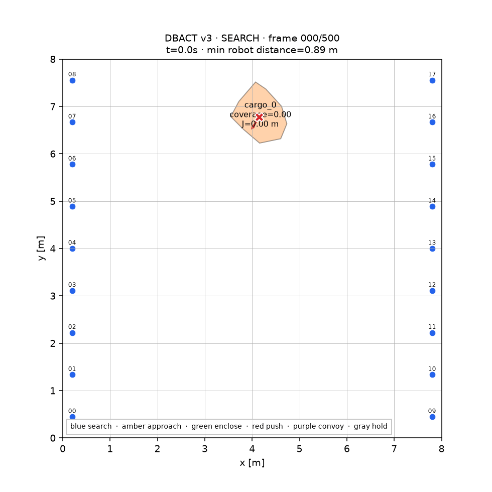
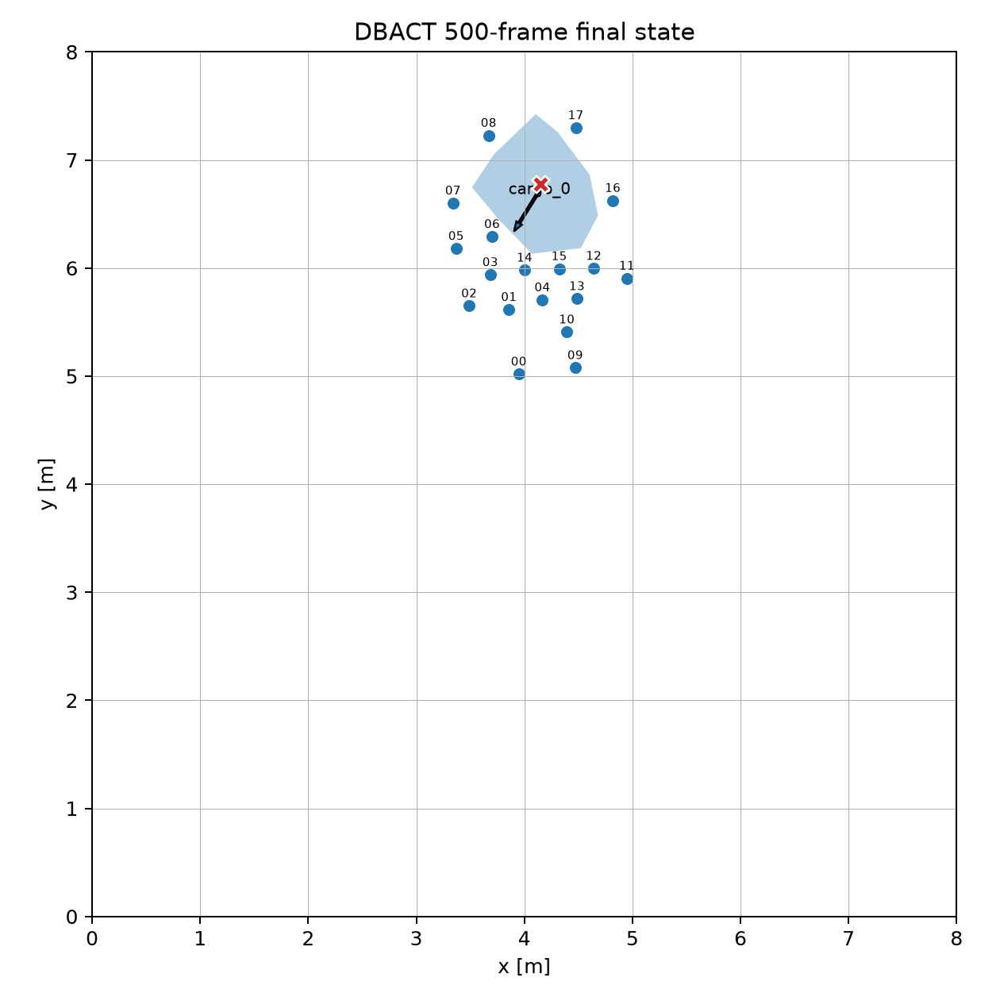

# DBACT v3: Certificate-Backed 500-Frame Closed Loop

Branch `A-boundary-aware-closed-loop-v3` deliberately separates two statements:

1. a deterministic paired-lane policy gives a finite-time discovery bound over
   the complete rectangular workspace; and
2. enclosure and transport carry a conditional guarantee only for simple
   polygons whose geometry, observed map, cage, swept corridor, force, error,
   safety, and time certificates all pass.

The controller has no L-shape whitelist. The default experiment creates a
seeded, previously unseen random simple polygon at a feasible pose and samples a
feasible task direction over 360 degrees. The exact theorem, predicates, and
non-claims are in [`CONDITIONAL_GUARANTEE.md`](CONDITIONAL_GUARANTEE.md).

## One-command demonstration

```bash
python scripts/run_500_closed_loop.py \
  --config configs/sim/v3/arbitrary_shape_full_workspace_500.yaml \
  --seed 0 --output runs/full_workspace_v3_seed0
```

The command executes exactly 500 control/physics steps and exits non-zero when
any strict validity gate fails. It writes the attributed summary and manifest,
trajectories, safety time series, paper figures, final plots, and an animation.
Use `--no-animation` for simulation-only timing. `--animation-stride 2` still
runs all 500 steps but renders every second recorded state.





## Seed-0 release artifact

The checked-in animation uses seed 0, all 500 control steps, and 251 rendered
states. The independent strict validator passes its `summary.json`.

| Quantity | Result |
| --- | ---: |
| Initial detections | 0 |
| First detection | frame 127 |
| Strict enclosure | frame 234 |
| Transport activation | frame 283 |
| HOLD | frame 462 |
| Random task angle | -121.94 degrees |
| Directional progress `J` | 0.0983 m |
| Progress efficiency | 0.9726 |
| Final strict coverage | 1.0000 |
| Cargo rotation | -5.36 degrees |
| Certified boundary-map gap upper bound | 0.0399 m (`epsilon_map = 0.20 m`) |
| Exact-QP solves / fallback / infeasible | 9,000 / 0 / 0 |
| Pure simulation throughput | 18.15 control frames/s |

Animation encoding is offline and is excluded from the throughput figure.

## Static 500-frame accounting

| Component | Certified or declared bound (frames) |
| --- | ---: |
| Full half-workspace lane sweep | 204 |
| Rendezvous | 37 |
| Finite-hop gossip | 27 |
| Post-release enclosure premise | 1 |
| Transport premise | 210 |
| Hold premise | 20 |
| Total | 499 |

Search coverage is proved from the workspace, lane spacing, finite ray count,
sensor range, and a constructive inscribed-feature witness. The post-release
enclosure and transport bounds are explicit conditional premises and are
checked against the finished trajectory; they are not inferred from the seed-0
animation.

## Conditional-domain and rejection evidence

Six seeded random-polygon candidates were evaluated with the same configuration.
Five passed the runtime map-density predicate and all **5/5 eligible runs**
passed the strict closed-loop validator. The sixth was rejected because its
maximum boundary-map gap was `0.5537 m > 0.20 m`, even though its physical run
looked successful. This is intentional fail-closed behavior.

| Metric over the five eligible runs | Mean | Range |
| --- | ---: | ---: |
| Directional progress `J` | 0.1243 m | 0.0983-0.1642 m |
| Progress efficiency | 0.9093 | 0.7175-0.9798 |
| Displacement | 0.1383 m | 0.1011-0.1707 m |
| Final strict coverage | 1.0000 | 1.0000-1.0000 |
| Cargo rotation | -4.97 degrees | -18.19-5.21 degrees |

Across those runs, 45,000 exact QPs completed with zero fallback and zero
infeasible solve. There were 228 optional robustness-margin relaxations. The
nominal hard barrier remained enforced, but the full configured `rho` robustness
margin must not be claimed on those relaxed frames.

The same controller also passed current 500-frame regressions for a circle,
cage-feasible U shape, and star, each with strict coverage 1.0. A deliberately
narrow U shape is rejected by the cage self-clearance certificate. These cases
exercise shape independence; they do not replace the admissibility predicates.

## Reproduction matrix

```bash
python scripts/run_batch.py \
  --configs configs/sim/v3/arbitrary_shape_full_workspace_500.yaml \
  --seeds 0..5 --steps 500 --out runs/full_workspace_sweep

python scripts/run_shape_workspace_matrix.py \
  --steps 500 --out runs/full_workspace_shape_matrix

python scripts/validate_run.py runs/full_workspace_v3_seed0/summary.json
```

The batch report shows candidate count, certificate-eligible count, rejections,
and success statistics over the conditional domain separately. It never hides
ineligible samples by averaging only survivors without reporting rejection.

## Implementation map

| File | Responsibility |
| --- | --- |
| `configs/sim/v3/arbitrary_shape_full_workspace_500.yaml` | Full-domain sampling, paired search, 360-degree task, and theorem bounds |
| `src/dbact/guarantees.py` | Executable geometry, search, map, cage, corridor, wrench, error, and time certificate |
| `src/dbact_sim/scenarios.py` | Paired deployment and seeded simple-polygon generation |
| `src/dbact/controller.py` | Sweep/rendezvous/gossip/map/enclose/transport/HOLD closed loop |
| `src/dbact/boundary_map.py` | Distributed voxel map and point-to-plane SE(2) registration |
| `src/dbact_sim/environment.py` | Independent runtime witness, phase log, and fail-closed success gate |
| `scripts/validate_run.py` | Independent certificate, solver, safety, phase, and outcome validation |
| `scripts/run_shape_workspace_matrix.py` | Same-controller diverse-shape regression and explicit rejection report |

## Claim boundary

The defensible present-tense statement is:

> The paired-lane finite-ray sensor tubes cover the complete rectangular
> workspace for every collision-free cargo pose carrying the configured
> inscribed-feature witness. For one unknown simple-polygon cargo whose
> epsilon-dense boundary map, cage corridor, covering number, zero-torque goal
> wrench, bounded errors, safety constraints, and finite-time premises all
> pass, the strict 500-frame validator requires safe enclosure, bounded positive
> task-direction transport, and HOLD using the exact hard-QP backend.

This is conditional, not universal over every planar set. Self-intersecting or
disconnected outlines, sub-resolution features, failed map completion,
wall-blocked cages, infeasible transport corridors, insufficient agents or
force, multiple mutually occluding cargoes, and unbounded errors are outside the
theorem domain.
