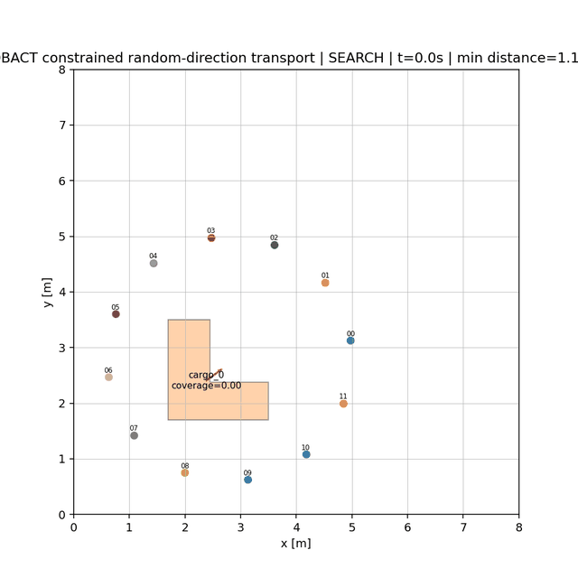
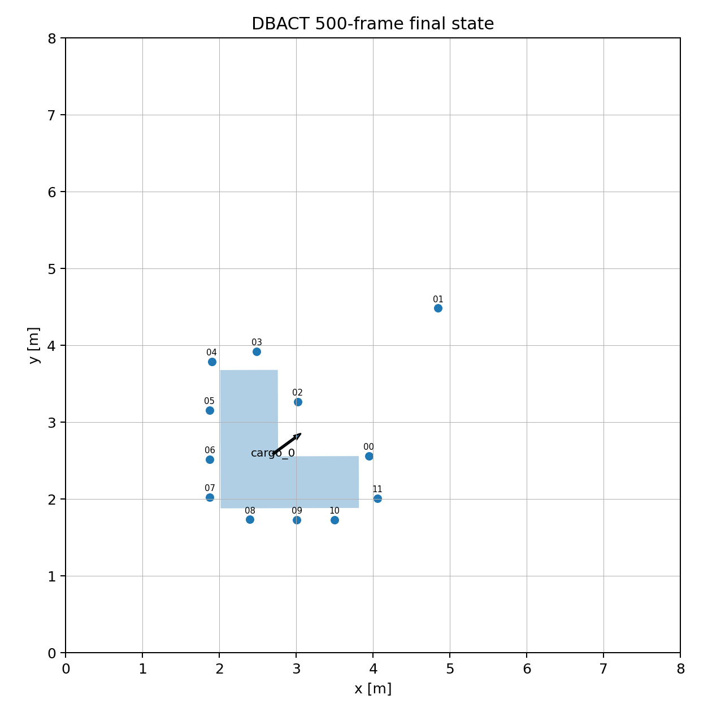
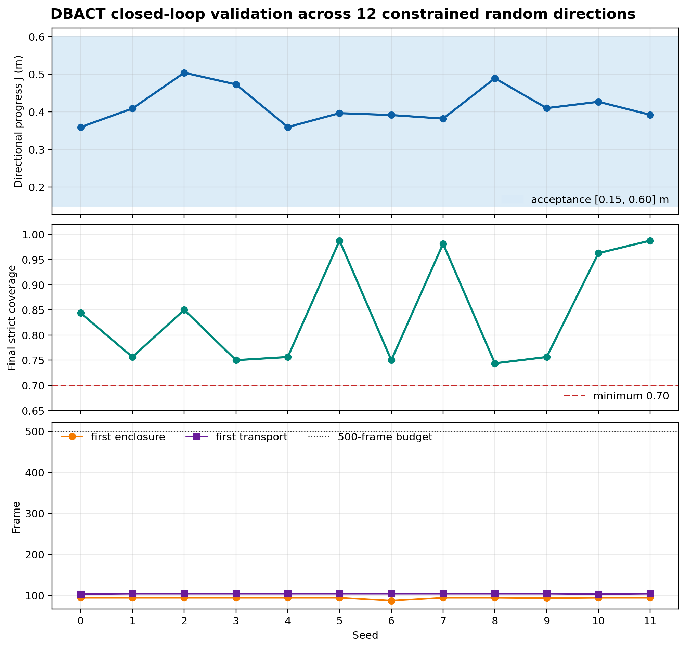

# DBACT 500-Frame Closed-Loop Transport

This document records the new closed-loop path on branch
`A-boundary-aware-closed-loop-v2`.  It is deliberately narrower than a claim of
general arbitrary-shape transport: the validated task is one L-shaped cargo, 12
robots, a bounded random goal direction, and 500 simulation frames.

## Reproduce the visual demonstration

```bash
python -m pip install -r requirements.txt
export PYTHONPATH=src
python scripts/run_500_closed_loop.py --seed 0 --output runs/closed_loop_seed0
```

The command always runs exactly 500 frames and writes:

- `summary.json` and `demo_manifest.json` with provenance and pass/fail gates;
- `trajectories.csv`, the final snapshot, and trajectory plot;
- paper frames at 0, 100, 200, 350, and 500;
- `closed_loop_500.gif` unless `--no-animation` is supplied.

The command exits with status 2 when any acceptance gate fails.  The animation
is therefore not treated as evidence independently of the recorded contracts.





## Closed-loop state sequence

The controller now executes a measurable sequence rather than enabling pushing
from the first contact:

1. **SEARCH** — local ray observations discover the unknown boundary.
2. **ENCLOSE** — local boundary memory and local CVT fill the visible gaps.
3. **TRANSPORT** — a contact quorum must persist for 35 steps; only then does a
   common task-direction feed-forward translate the enclosure.  The physics
   engine, not the task configuration, is the only mechanism that moves cargo.
4. **HOLD** — local point-to-plane map registration integrates signed transport
   progress and latches the transport command off after 0.30 m.

The random goal is task state.  It is seeded, restricted to `[-10°, 60°]`, and
rejected when the requested target would violate a 1 m workspace margin.

## What changed relative to `A-boundary-aware`

| Layer | New behavior | Why it was needed |
| --- | --- | --- |
| Local boundary map | Point-to-plane translation registration and world-map compensation | The old world-frame memory stayed behind when cargo moved. |
| Object velocity | Derived from registered map motion | Visible-arc centroid differencing created fictitious velocities and infeasible object rows. |
| Task supervisor | Dwell-gated SEARCH/ENCLOSE/TRANSPORT/HOLD sequence | Contact alone was too weak a transport trigger. |
| Enclosure motion | Common feed-forward plus push-side inward preload | Moving only the rear arc tore the cage and recreated the quasi-static stall. |
| Local safety rows | Retain locally visible/supporting half-spaces | A relayed far face of a thin concavity must not constrain a robot on the opposite side. |
| Stop condition | Local signed progress estimate and completion latch | Prevents unbounded motion without reading simulator cargo pose. |
| C3 contract | Lower and upper progress bounds, coverage, rotation, phase order | A visually plausible GIF is insufficient for a transport claim. |
| Scenario | Reproducible bounded random goal | Makes the direction random without silently creating wall collisions. |

## Current validation result

Twelve seeds were run for 500 frames each using
`configs/sim/v2/l_shape_closed_loop_500.yaml`.  All 12 passed the configured
contract.  Across 72,000 QP solves there were zero fallbacks and zero infeasible
solves; three calls relaxed only the optional ISSf robustness margin while the
base hard barrier remained active.

| Metric | Mean ± population SD | Range | Acceptance |
| --- | ---: | ---: | ---: |
| Directional progress `J` | 0.4157 ± 0.0462 m | 0.3591–0.5036 m | 0.15–0.60 m |
| Progress efficiency | 0.9877 ± 0.0170 | 0.9474–0.9999 | ≥ 0.70 |
| Final strict coverage | 0.8438 ± 0.1020 | 0.7438–0.9875 | ≥ 0.70 |
| Cargo rotation | 0.0145 ± 0.1093° | −0.1263–0.2901° | absolute value ≤ 5° |
| Minimum signed clearance | 0.1137 ± 0.0016 m | 0.1090–0.1156 m | ≥ 0 m |
| Minimum robot separation | 0.3237 ± 0.0030 m | 0.3200–0.3296 m | ≥ 0.32 m |
| First enclosure | frame 93.3 ± 1.9 | frame 87–94 | before transport |
| First transport | frame 103.8 ± 0.4 | frame 103–104 | within 500 frames |



For seed 0, the simulation portion completed in 28.65 s, or 17.45 simulated
frames per wall-clock second on the validation host.  GIF export is additional
post-processing time and is not included in that rate.

## What these results do and do not establish

The branch establishes an executable engineering loop for one concave cargo and
a bounded family of random directions.  It does **not** yet establish general
caging or transport for arbitrary irregular objects.

The following work remains before a strong paper claim is defensible:

1. Replace translation-only registration with robust `SE(2)` estimation and
   derive a bound on translational and angular estimation error.
2. State and prove a discrete-time moving-boundary CBF/ISSf theorem using that
   bound; account explicitly for the three optional-margin relaxations.
3. Define the contribution as boundary enclosure/contact formation unless an
   immobilization or caging theorem is actually proved.
4. Run at least 20–50 seeds for multiple convex and concave random polygons,
   multiple scales, and directions spanning the full feasible 360° workspace.
5. Add noise, occlusion, packet loss, communication delay, friction/mass, and
   robot-count sweeps, plus ablations for map compensation, phase gating, and
   common enclosure feed-forward.
6. Compare against fixed-center CVT, no-motion-compensation, push-only, and an
   oracle/full-shape baseline using identical contact physics and validity gates.
7. Cross-validate the complete 500-frame controller with the independent PyMunk
   engine, then proceed through MAS dry-run, OptiTrack replay, and guarded
   low-speed hardware tests.
8. Profile and move sensing/PCA, boundary-map updates, and local-CVT grid work to
   multirate or vectorized execution.  The current 17.45 frame/s is fast for
   iteration but below a strict 20 Hz real-time target.

## Recommended paper claim boundary

A defensible present-tense statement is:

> In a 2-D penalty-contact simulation, 12 decentralized agents using local
> boundary observations complete discovery, boundary enclosure, and bounded
> directional transport of one unknown L-shaped cargo within 500 frames for 12
> seeded task directions in a constrained angular range.

Do not replace “one unknown L-shaped cargo” with “arbitrary-shaped objects” until
the broader experiment matrix and the missing theoretical conditions above are
closed.
