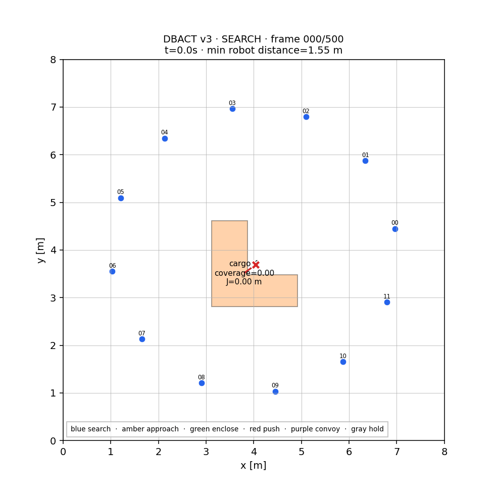
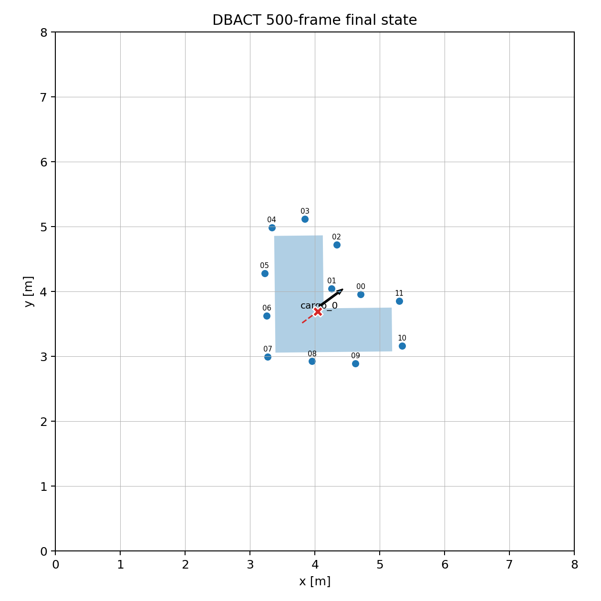
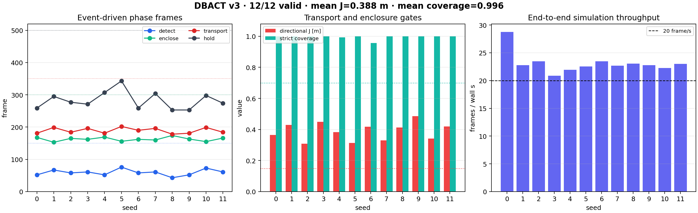

# DBACT v3: 500-Frame Search, Enclosure, and Bounded Transport

Branch `A-boundary-aware-closed-loop-v3` closes the main gap left by v2: the
episode now begins with **zero cargo observations**. Twelve agents sweep a
controlled work region, discover a seeded random-position L-shaped cargo from
local rays, enclose its boundary, transport it along a reproducible random
direction, and latch into HOLD within a fixed 500-step budget.

This is an engineering result for one concave shape and a controlled experiment
region. It is not a claim of formal caging or arbitrary-shape global search.

## One-command demonstration

```bash
conda env update -n dbact -f environment.yml
conda run -n dbact python scripts/run_500_closed_loop.py \
  --seed 0 --output runs/closed_loop_v3_seed0
```

The command runs exactly 500 control/physics steps and exits non-zero when any
validity gate fails. It writes:

- `summary.json`, `demo_manifest.json`, trajectories, and safety time series;
- frame 0/100/200/350/500 paper figures and final trajectory/snapshot plots;
- `closed_loop_500.gif` containing the initial state plus all 500 control steps.

Use `--no-animation` for simulation-only timing. Rendering is offline
post-processing and is not included in `simulation_frames_per_wall_second`.





## Executable phase contract

| Phase event | Deadline | Seed-0 frame | Twelve-seed range |
| --- | ---: | ---: | ---: |
| First detection | 150 | 52 | 43–76 |
| Strict enclosure ≥ 0.70 | 300 | 168 | 153–174 |
| Transport activation | 350 | 181 | 178–202 |
| Bounded-progress HOLD | 500 | 259 | 253–343 |

The supervisor is event-driven; deadlines are validity gates, not scheduled
phase switches. Transport requires a 45-step local contact quorum and cannot be
declared successful before strict enclosure. HOLD is triggered by locally
integrated point-to-plane map motion after 0.30 m, not by simulator cargo pose.

The scenario-level contracts are:

- seeded random cargo reference point in the configured central search region;
- every initial robot-to-polygon clearance greater than the 1.20 m sensor range;
- connected 3.0 m deployment ring and a contracting/rotating search sweep that
  depends on workspace, time, and the robot's initial slot—not cargo position;
- seeded task direction in the controlled interval `[-10°, 60°]`;
- target/cargo footprint rejection against workspace margins;
- contact-only penalty dynamics; the transport engine never reads the goal;
- 500 steps, safe initial state, hard QP, zero fallback/infeasibility, and C3
  progress/coverage/rotation/safety gates.

## Efficiency changes

The safety QP and contact physics remain at 20 Hz. Expensive ray/PCA sensing,
voxel-map registration, density construction, and Local CVT planning run every
third step (6.67 Hz), so their held result is at most 100 ms old. The object
velocity estimate is correspondingly low-pass filtered before entering the
moving-boundary ISSf row.

Two implementation changes remove avoidable overhead:

1. fused map observations are rebuilt only on perception frames and reused
   between updates;
2. an entire scan is quantized to voxel indices in one NumPy operation instead
   of calling `np.round` for every packet.

The final seed-0 visual-demo run simulated at **27.76 frame/s** on the validation host. Across
the twelve-seed batch, conservative end-to-end throughput (including environment
construction and output serialization) averaged **23.14 frame/s**, with range
**20.87–28.77 frame/s**. All twelve runs remained above 20 frame/s.

## Twelve-seed validation

```bash
conda run -n dbact python scripts/run_batch.py \
  --configs configs/sim/v3/l_shape_search_closed_loop_500.yaml \
  --seeds 0..11 --steps 500 --out runs/v3_sweep_12

conda run -n dbact python scripts/plot_closed_loop_sweep.py \
  runs/v3_sweep_12/batch_report.json \
  --output runs/v3_sweep_12/closed_loop_sweep.png
```

All **12/12** runs passed. Across **72,000 hard-QP solves**, there were zero
fallbacks, zero infeasible solves, and zero optional-margin relaxations.

| Metric | Mean | Range | Acceptance |
| --- | ---: | ---: | ---: |
| Directional progress `J` | 0.3880 m | 0.3082–0.4860 m | 0.15–0.60 m |
| Progress efficiency | 0.9909 | 0.9665–0.9998 | ≥ 0.70 |
| Final strict coverage | 0.9958 | 0.9563–1.0000 | ≥ 0.70 |
| Cargo rotation | 0.0697° | −0.2257–0.6232° | absolute value ≤ 5° |
| Minimum robot separation | 0.3883 m | 0.3207–0.4707 m | ≥ 0.32 m |
| Goal angle | 31.86° | 2.57–58.34° | configured interval |



## Implementation map

| File | Responsibility |
| --- | --- |
| `configs/sim/v3/l_shape_search_closed_loop_500.yaml` | Zero-observation search, deadlines, multi-rate control, and controlled random task |
| `src/dbact_sim/scenarios.py` | Seeded cargo-position sampler, initial sensor-gap contract, and goal footprint rejection |
| `src/dbact/controller.py` | Contracting-ring search and multi-rate perception/planning with per-step safety |
| `src/dbact/boundary_map.py` | Vectorized scan-to-voxel quantization and moving-map registration |
| `src/dbact_sim/environment.py` | Initial-observation audit, phase deadlines, target provenance, and per-agent modes |
| `src/dbact_sim/visualization.py` | Phase/role colors, goal route, coverage, progress, and 500-step animation |
| `scripts/validate_run.py` | Independent revalidation of frame, discovery, phase, solver, safety, and success contracts |

## Claim boundary and remaining work

The defensible present-tense statement is:

> In a 2-D penalty-contact simulation, twelve decentralized agents starting
> outside the sensing horizon discover, enclose, and boundedly transport one
> seeded random-position L-shaped cargo within 500 steps for twelve seeded task
> directions in a controlled angular range.

The branch does not establish arbitrary-shape or full-workspace global search.
Before making that stronger claim, validate random simple concave polygons,
multiple workspace cells, full feasible 360° directions, perception/communication
faults, multiple robot counts, and an independent PyMunk end-to-end matrix. The
translation-only map registration also remains a known limitation for cargoes
with significant rotation.
